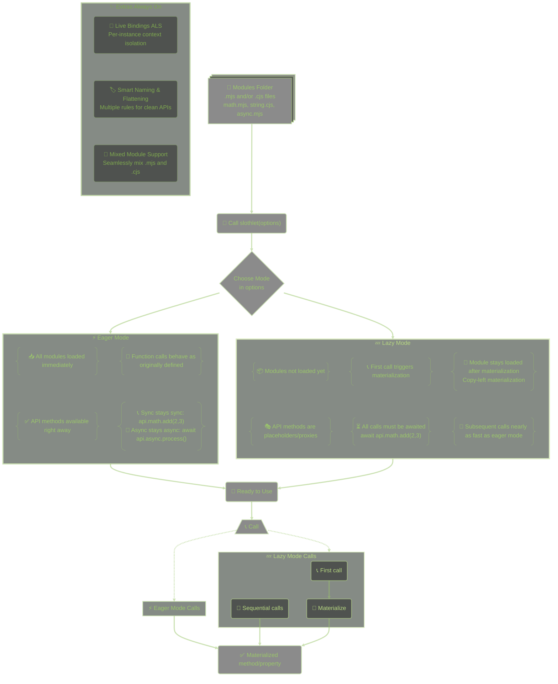

# @cldmv/slothlet

<div align="center">
  
</div>

**@cldmv/slothlet** is a sophisticated module loading framework that revolutionizes how you work with massive APIs in Node.js. Built for developers who demand smart, efficient module loading without compromising performance or developer experience.

Choose your loading strategy based on your needs: **lazy mode** loads modules on-demand for faster startup and lower memory usage, while **eager mode** loads everything upfront for maximum runtime performance and predictable behavior.

With our **copy-left materialization** in lazy mode, you get the best of both worlds: the memory efficiency of on-demand loading with near-eager performance on repeated calls. Once a module is materialized, it stays materialized-no re-processing overhead.

The name might suggest we're taking it easy, but don't be fooled. **Slothlet delivers speed where it counts**, with smart optimizations that make your APIs fly.

**🎉 Welcome to the future of module loading with Slothlet v3!**

> _Where sophisticated architecture meets blazing performance - slothlet is anything but slow._

[![npm version]][npm_version_url] [![npm downloads]][npm_downloads_url] <!-- [![GitHub release]][github_release_url] -->[![GitHub downloads]][github_downloads_url] [![Last commit]][last_commit_url] <!-- [![Release date]][release_date_url] -->[![npm last update]][npm_last_update_url] [![coverage]][coverage_url]

> [!NOTE]
> **🚀 Production Ready Modes:**
>
> - **Eager Mode**: Fully stable and production-ready for immediate module loading
> - **Lazy Mode**: Production-ready with advanced copy-left materialization and 2.2x faster startup (function calls within 6% of eager - essentially equal)

[![Contributors]][contributors_url] [![Sponsor shinrai]][sponsor_url]

---

## 🎉 Introducing Slothlet v3.0

> [!IMPORTANT]
> **Slothlet v3.0 is a major release - the biggest since v2.0.**

v3 rebuilds Slothlet from the inside out with a **Unified Wrapper architecture** that delivers consistent, inspectable, hook-intercepted API proxies across every loading mode. On top of this foundation comes a redesigned hook system with three-phase subset ordering, per-request context isolation improvements, a full internationalization layer, background materialization with progress tracking, granular API mutation controls, collision modes for runtime API management, and lifecycle events for every stage of the module lifecycle.

Every feature has been hardened with a comprehensive test suite - over **5,300 tests** across eager, lazy, CJS, ESM, TypeScript, and mixed module scenarios.

### What's New in v3.0

- 🏗️ **Unified Wrapper** - single consistent proxy layer for all modes; `console.log(api.math)` now shows real contents
- 🎣 **Redesigned Hook System** - new `hook:` config key, `api.slothlet.hook.*` access path, three-phase subset ordering (`before → primary → after`)
- 🌍 **Full i18n** - all error and debug messages are translated and available in 9 languages: English, Spanish, French, German, Portuguese, Italian, Japanese, Chinese (Simplified), and Korean
- 💤 **Background Materialization** - `backgroundMaterialize: true` pre-loads lazy modules without blocking; `api.slothlet.materialize.wait()` to await completion
- ⚡ **Lifecycle Events** - subscribe to `impl:created`, `impl:changed`, `impl:removed`, and `materialized:complete` via `api.slothlet.lifecycle.on/off()`
- 🔀 **Collision Modes** - replace `allowApiOverwrite` with typed modes: `merge`, `skip`, `overwrite`, `throw` - independently configurable for initial load vs runtime `add()`
- 🔒 **Mutation Controls** - granular per-operation enable/disable for `add`, `remove`, and `reload`
- 🧹 **Sanitization Improvements** - runtime `api.slothlet.sanitize()` method; helper export renamed to `sanitizePropertyName`
- 🔄 **Improved Context Isolation** - `.run()` and `.scope()` use a child-instance model; full isolation between Slothlet instances

📋 **[See the full v3.0 changelog](./docs/changelog/v3.0.md)**

---

## ✨ What's New

### Latest: v3.2.3 (April 2026)

- **Publish workflow fix** — switched CI trigger from `pull_request` to `push` on master so releases publish immediately on merge without depending on the PR event payload
- [View full v3.2.3 Changelog](./docs/changelog/v3/v3.2.3.md)

### Recent Releases

- **v3.2.2** (April 2026) — missing `set` trap on version dispatchers; `util.inspect(api.auth)` now shows resolved versioned namespace ([Changelog](./docs/changelog/v3/v3.2.2.md))
- **v3.2.1** (April 2026) — version-dispatcher `defineProperty` trap fix; pre-commit validation cleanup ([Changelog](./docs/changelog/v3/v3.2.1.md))
- **v3.2.0** (April 2026) — API Path Versioning (`versionDispatcher`, `api.slothlet.versioning.*`, version metadata, dispatcher proxy); lazy-mode shutdown race fix ([Changelog](./docs/changelog/v3/v3.2.0.md))
- **v3.1.0** (March 2026) — Frozen `api.slothlet.env` snapshot; `env.include` allowlist; reload immunity ([Changelog](./docs/changelog/v3/v3.1.0.md))


📚 **For complete version history and detailed release notes, see [docs/changelog/](./docs/changelog/) folder.**

---

## 🚀 Key Features

### 🎯 **Dual Loading Strategies**

- **Eager Loading**: Immediate loading for maximum performance in production environments
- **Lazy Loading**: Copy-left materialization with look-ahead proxies (2.2x faster startup, function calls equal to eager after materialization)

> [!IMPORTANT]
> **Function Call Patterns:**
>
> - **Lazy Mode**: ALL function calls must be awaited (`await api.math.add(2, 3)`) due to materialization process
> - **Eager Mode**: Functions behave as originally defined - sync functions are sync (`api.math.add(2, 3)`), async functions are async (`await api.async.process()`)

### ⚡ Performance Excellence

- **Startup Performance**: 2.2x faster startup in lazy mode (15.41ms vs 34.28ms)
- **Runtime Performance**: Function calls essentially equal between modes (9.99μs lazy vs 9.46μs eager - within 6% measurement noise)
- **Copy-left materialization**: Once loaded, modules stay materialized - no re-processing overhead
- **Zero dependencies**: Pure Node.js implementation
- **Memory efficiency**: Lazy mode loads modules on-demand, eager mode optimizes for predictable behavior

**Mode Selection Guide:**

- **Eager Mode**: Best for production environments with maximum runtime performance and predictable behavior
- **Lazy Mode**: Best for development and applications with large APIs where startup time matters

📊 **For comprehensive performance benchmarks and analysis, see [docs/PERFORMANCE.md](https://github.com/CLDMV/slothlet/blob/master/docs/PERFORMANCE.md)**

### 🎣 **Hook System** _(redesigned in v3)_

Powerful function interceptor system with 4 hook types and three-phase subset ordering:

- **`before`** - Modify arguments or cancel execution (**must be synchronous**)
- **`after`** - Transform return values
- **`always`** - Observe final results (read-only; fires even on short-circuit)
- **`error`** - Monitor and handle errors with detailed source tracking

Each hook type supports three ordered execution **subsets**: `"before"` → `"primary"` (default) → `"after"`. Pattern matching, priority control, runtime enable/disable, and short-circuit support included.

🎣 **For complete hook system documentation, see [docs/HOOKS.md](https://github.com/CLDMV/slothlet/blob/master/docs/HOOKS.md)**

### 🌍 **Full Internationalization** _(new in v3)_

All error messages and debug output are translated. Supported languages:
English · Spanish · French · German · Portuguese · Italian · Japanese · Chinese (Simplified) · Korean

Configure via `i18n: { language: "es" }` in your slothlet config.

### 🔄 **Context Propagation**

Automatic context preservation across all asynchronous boundaries:

- **Per-request isolation**: `api.slothlet.context.run(ctx, fn)` and `api.slothlet.context.scope(ctx)`
- **EventEmitter propagation**: Context maintained across all event callbacks
- **Class instance propagation**: Context preserved in class method calls
- **Zero configuration**: Works automatically with TCP servers, HTTP servers, and custom EventEmitters

🔄 **For context propagation details, see [docs/CONTEXT-PROPAGATION.md](https://github.com/CLDMV/slothlet/blob/master/docs/CONTEXT-PROPAGATION.md)**

### 🔧 **Smart API Management**

- **Intelligent Flattening**: Clean APIs with automatic structure optimization (`math/math.mjs` → `api.math`)
- **Smart Naming**: Preserves original capitalization (`auto-ip.mjs` with `autoIP` → `api.autoIP`)
- **Advanced Sanitization**: Custom naming rules with glob and boundary patterns; `api.slothlet.sanitize()` at runtime
- **Hybrid Exports**: Support for callable APIs with methods, default + named exports

🏗️ **For module structure examples, see [docs/MODULE-STRUCTURE.md](https://github.com/CLDMV/slothlet/blob/master/docs/MODULE-STRUCTURE.md)**
📐 **For API flattening rules, see [docs/API-RULES/API-FLATTENING.md](https://github.com/CLDMV/slothlet/blob/master/docs/API-RULES/API-FLATTENING.md)**

### 🔗 **Runtime & Context System**

- **Context Isolation**: Automatic per-request isolation using AsyncLocalStorage (default); switchable to live-bindings mode via `runtime: "live"` config option
- **Cross-Module Access**: `self` and `context` always available inside API modules via `@cldmv/slothlet/runtime`
- **Mixed Module Support**: Seamlessly blend ESM and CommonJS modules
- **Copy-Left Preservation**: Materialized functions stay materialized

### 🛠 **Developer Experience**

- **TypeScript-Friendly**: Comprehensive JSDoc annotations with auto-generated declarations
- **Configurable Debug**: Detailed logging via CLI flags or environment variables
- **Multiple Instances**: Parameter-based isolation for complex applications
- **Inspectable APIs**: `console.log(api.math)` and logical versioned paths like `console.log(api.auth)` show real module contents instead of proxy internals (v3+)
- **Development Checks**: Built-in environment detection with silent production behavior

---

## 📦 Installation

### Requirements

- **Node.js v16.20.2 or higher** (required for stack trace API fixes used in path resolution)
  - Node.js 16.4–16.19 has a stack trace regression. For these versions, use slothlet 2.10.0: `npm install @cldmv/slothlet@2.10.0`

### Install

```bash
npm install @cldmv/slothlet
```

---

## 🚀 Quick Start

### ESM (ES Modules)

```javascript
import slothlet from "@cldmv/slothlet";

// Direct usage - eager mode by default
const api = await slothlet({
	dir: "./api",
	context: { user: "alice" }
});

// Eager mode: Functions behave as originally defined
const result = api.math.add(2, 3); // Sync function - no await needed
const asyncResult = await api.async.processData({ data: "async" });

// Access both ESM and CJS modules seamlessly
const esmResult = api.mathEsm.multiply(4, 5);
const cjsResult = api.mathCjs.divide(10, 2);
```

### CommonJS (CJS)

```javascript
const slothlet = require("@cldmv/slothlet");

const api = await slothlet({
	dir: "./api",
	context: { env: "production" }
});

const result = api.math.multiply(4, 5);
const mixedResult = await api.interop.processData({ data: "test" });
```

### Lazy Loading Mode

```javascript
import slothlet from "@cldmv/slothlet";

// Lazy mode with copy-left materialization
const api = await slothlet({
	mode: "lazy",
	dir: "./api",
	apiDepth: 3
});

// First access: materialization overhead (~1.45ms average)
const result1 = await api.math.add(2, 3);

// Subsequent access: materialized function (near-eager performance)
const result2 = await api.math.add(5, 7);
```

### Hook System Example _(v3 API)_

```javascript
import slothlet from "@cldmv/slothlet";

const api = await slothlet({
	dir: "./api",
	hook: true // Enable hooks - note: "hook" singular (v3)
});

// Before hook: Modify arguments
api.slothlet.hook.on(
	"before:math.add",
	({ path, args }) => {
		console.log(`Calling ${path} with args:`, args);
		return [args[0] * 2, args[1] * 2]; // Return array to replace arguments
	},
	{ id: "double-args", priority: 100 }
);

// After hook: Transform result
api.slothlet.hook.on(
	"after:math.*",
	({ path, result }) => {
		console.log(`${path} returned:`, result);
		return result * 10;
	},
	{ id: "scale-result" }
);

// Always hook: Observe final result (read-only)
api.slothlet.hook.on(
	"always:**",
	({ path, result, hasError }) => {
		console.log(hasError ? `${path} failed` : `${path} succeeded`);
	},
	{ id: "logger" }
);

// Error hook: Monitor errors with source tracking
api.slothlet.hook.on(
	"error:**",
	({ path, error, source }) => {
		console.error(`Error in ${path}:`, error.message);
		console.error(`Source: ${source.type}`); // 'before' | 'after' | 'function' | 'always'
	},
	{ id: "error-monitor" }
);

// Call function - hooks execute automatically
const result = await api.math.add(2, 3);
```

### Dynamic API Extension _(v3 API)_

```javascript
import slothlet from "@cldmv/slothlet";

const api = await slothlet({ dir: "./api" });

// Add modules at runtime
await api.slothlet.api.add("plugins", "./plugins-folder");
api.plugins.myPlugin();

// Create nested API structures
await api.slothlet.api.add("runtime.plugins", "./more-plugins");
api.runtime.plugins.loader();

// Add with metadata for security/authorization
await api.slothlet.api.add("plugins.trusted", "./trusted-plugins", {
	trusted: true,
	permissions: ["read", "write", "admin"]
});

// Remove and reload
await api.slothlet.api.remove("oldModule");
await api.slothlet.api.reload("database.*");
```

---

## 📚 Configuration Options

| Option                    | Type      | Default       | Description                                                                                                                                                                                                  |
| ------------------------- | --------- | ------------- | ------------------------------------------------------------------------------------------------------------------------------------------------------------------------------------------------------------ |
| `dir`                     | `string`  | `"api"`       | Directory to load API modules from (absolute or relative path)                                                                                                                                               |
| `mode`                    | `string`  | `"eager"`     | Loading mode - `"lazy"` for on-demand loading, `"eager"` for immediate loading                                                                                                                               |
| `runtime`                 | `string`  | `"async"`     | Runtime binding system: `"async"` for AsyncLocalStorage (default), `"live"` for live-bindings                                                                                                               |
| `apiDepth`                | `number`  | `Infinity`    | Directory traversal depth - `0` for root only, `Infinity` for all levels                                                                                                                                    |
| `debug`                   | `boolean` | `false`       | Enable verbose logging (also via `--slothletdebug` flag or `SLOTHLET_DEBUG=true` env var)                                                                                                                    |
| `context`                 | `object`  | `{}`          | Context data injected into live-binding (available via `import { context } from "@cldmv/slothlet/runtime"`)                                                                                                  |
| `reference`               | `object`  | `{}`          | Reference object merged into API root level                                                                                                                                                                  |
| `sanitize`                | `object`  | `{}`          | Advanced filename-to-API transformation control with `lowerFirst`, `preserveAllUpper`, `preserveAllLower`, and `rules` (supports exact matches, glob patterns `*json*`, and boundary patterns `**url**`)     |
| `hook`                    | `mixed`   | `false`       | Enable hook system: `true` (enable all), `"pattern"` (enable with pattern), or object with `enabled`, `pattern`, `suppressErrors` options - **note: `hook` singular, not `hooks`**                           |
| `backgroundMaterialize`   | `boolean` | `false`       | In lazy mode: start background pre-loading of all modules immediately after init; automatically enables materialization tracking and the `materialized:complete` lifecycle event                              |
| `api.collision`           | `mixed`   | `"merge"`     | Collision mode for API namespace conflicts: `"merge"`, `"skip"`, `"overwrite"`, `"throw"` - or `{ initial: "merge", api: "skip" }` to set independently for load vs runtime `add()`                          |
| `api.mutations`           | `object`  | all `true`    | Per-operation mutation controls: `{ add: true, remove: true, reload: true }` - set any to `false` to disable                                                                                                 |
| `versionDispatcher`       | `mixed`   | `undefined`   | Version routing discriminator: `"version"` (or any string key) looks up that key in the caller's version metadata; a function receives `(allVersions, caller)` and returns a tag or `null`; `undefined` behaves like `"version"` |
| `i18n`                    | `object`  | `{}`          | Internationalization settings: `{ language: "en" }` - supported: `en`, `es`, `fr`, `de`, `pt`, `it`, `ja`, `zh`, `ko`                                                                                       |

---

## 🔀 How Slothlet Works: Loading Modes Explained


```mermaid
flowchart TD
    MODULEFOLDERS --> SLOTHLET
    SLOTHLET --> CHOOSEMODE

    CHOOSEMODE --> LAZY
    CHOOSEMODE --> EAGER

    subgraph EAGER ["⚡ Eager Mode"]
        direction TB
        EAGER0 ~~~ EAGER1
        EAGER2 ~~~ EAGER3

        EAGER0@{ shape: braces, label: "📥 All modules loaded immediately" }
        EAGER1@{ shape: braces, label: "✅ API methods available right away" }
        EAGER2@{ shape: braces, label: "🔄 Function calls behave as originally defined" }
        EAGER3@{ shape: braces, label: "📞 Sync stays sync: api.math.add(2,3)<br/>🔄 Async stays async: await api.async.process()" }
    end

    subgraph LAZY ["💤 Lazy Mode"]
        direction TB
        LAZY0 ~~~ LAZY1
        LAZY2 ~~~ LAZY3
        LAZY4 ~~~ LAZY5

        LAZY0@{ shape: braces, label: "📦 Modules not loaded yet" }
        LAZY1@{ shape: braces, label: "🎭 API methods are placeholders/proxies" }
        LAZY2@{ shape: braces, label: "📞 First call triggers materialization" }
        LAZY3@{ shape: braces, label: "⏳ All calls must be awaited<br/>await api.math.add(2,3)" }
        LAZY4@{ shape: braces, label: "💾 Module stays loaded after materialization<br/>Copy-left materialization" }
        LAZY5@{ shape: braces, label: "🚀 Subsequent calls nearly as fast as eager mode" }
    end

    subgraph EAGERCALL ["⚡ Eager Mode Calls"]
        direction TB
    end

    subgraph LAZYCALL ["💤 Lazy Mode Calls"]
        direction TB
        LAZYCALL0 --> LAZYCALL2

        LAZYCALL0@{ shape: rounded, label: "📞 First call" }
        LAZYCALL1@{ shape: rounded, label: "🔁 Sequential calls" }
        LAZYCALL2@{ shape: rounded, label: "🧩 Materialize" }
    end

    EAGER --> READYTOUSE
    LAZY --> READYTOUSE

    READYTOUSE --> CALL
    CALL -.-> EAGERCALL
    CALL -.-> LAZYCALL

    EAGERCALL --> MATERIALIZEDFUNCTION
    LAZYCALL1 --> MATERIALIZEDFUNCTION
    LAZYCALL2 --> MATERIALIZEDFUNCTION

    READYTOUSE@{ shape: rounded, label: "🎯 Ready to Use" }
    MATERIALIZEDFUNCTION@{ shape: rounded, label: "✅ Materialized method/property" }
    CALL@{ shape: trap-b, label: "📞 Call" }

    subgraph ALWAYS ["✨ Extras Always On"]
        direction TB
        ALWAYS0 ~~~ ALWAYS1
        ALWAYS1 ~~~ ALWAYS2

        ALWAYS0@{ shape: rounded, label: "🔗 Live Bindings ALS<br/>Per-instance context isolation" }
        ALWAYS1@{ shape: rounded, label: "🏷️ Smart Naming & Flattening<br/>Multiple rules for clean APIs" }
        ALWAYS2@{ shape: rounded, label: "🔄 Mixed Module Support<br/>Seamlessly mix .mjs and .cjs" }
    end

    MODULEFOLDERS@{ shape: st-rect, label: "📁 Modules Folder<br/>.mjs and/or .cjs files<br/>math.mjs, string.cjs, async.mjs" }
    SLOTHLET@{ shape: rounded, label: "🔧 Call slothlet(options)" }
    CHOOSEMODE@{ shape: diamond, label: "Choose Mode<br/>in options" }

    style EAGER0 stroke:#9BC66B,color:#9BC66B,opacity:0.5
    style EAGER1 stroke:#9BC66B,color:#9BC66B,opacity:0.5
    style EAGER2 stroke:#9BC66B,color:#9BC66B,opacity:0.5
    style EAGER3 stroke:#9BC66B,color:#9BC66B,opacity:0.5

    style LAZY0 stroke:#9BC66B,color:#9BC66B,opacity:0.5
    style LAZY1 stroke:#9BC66B,color:#9BC66B,opacity:0.5
    style LAZY2 stroke:#9BC66B,color:#9BC66B,opacity:0.5
    style LAZY3 stroke:#9BC66B,color:#9BC66B,opacity:0.5
    style LAZY4 stroke:#9BC66B,color:#9BC66B,opacity:0.5
    style LAZY5 stroke:#9BC66B,color:#9BC66B,opacity:0.5

    style MODULEFOLDERS fill:#1a1a1a,stroke:#9BC66B,stroke-width:2px,color:#9BC66B,opacity:0.5
    style SLOTHLET fill:#1a1a1a,stroke:#9BC66B,stroke-width:2px,color:#9BC66B,opacity:0.5
    style CHOOSEMODE fill:#1a1a1a,stroke:#9BC66B,stroke-width:2px,color:#9BC66B,opacity:0.5
    style READYTOUSE fill:#1a1a1a,stroke:#9BC66B,stroke-width:2px,color:#9BC66B,opacity:0.5
    style CALL fill:#1a1a1a,stroke:#9BC66B,stroke-width:2px,color:#9BC66B,opacity:0.5
    style MATERIALIZEDFUNCTION fill:#1a1a1a,stroke:#9BC66B,stroke-width:2px,color:#9BC66B,opacity:0.5

    style EAGER fill:#0d1a0d,stroke:#9BC66B,stroke-width:3px,color:#9BC66B,opacity:0.5
    style EAGERCALL fill:#0d1a0d,stroke:#9BC66B,stroke-width:2px,color:#9BC66B,opacity:0.5

    style LAZY fill:#0d1a0d,stroke:#B8D982,stroke-width:3px,color:#B8D982,opacity:0.5
    style LAZYCALL fill:#0d1a0d,stroke:#B8D982,stroke-width:2px,color:#B8D982,opacity:0.5
    style LAZYCALL0 fill:#1a1a1a,stroke:#B8D982,stroke-width:2px,color:#B8D982,opacity:0.5
    style LAZYCALL1 fill:#1a1a1a,stroke:#B8D982,stroke-width:2px,color:#B8D982,opacity:0.5
    style LAZYCALL2 fill:#1a1a1a,stroke:#B8D982,stroke-width:2px,color:#B8D982,opacity:0.5

    style ALWAYS fill:#0d1a0d,stroke:#7FA94F,stroke-width:3px,color:#7FA94F,opacity:0.5
    style ALWAYS0 fill:#1a1a1a,stroke:#7FA94F,stroke-width:1px,color:#7FA94F,opacity:0.5
    style ALWAYS1 fill:#1a1a1a,stroke:#7FA94F,stroke-width:1px,color:#7FA94F,opacity:0.5
    style ALWAYS2 fill:#1a1a1a,stroke:#7FA94F,stroke-width:1px,color:#7FA94F,opacity:0.5

    linkStyle default stroke:#9BC66B,stroke-width:3px,opacity:0.5
    linkStyle 4,5,6,7,8,18,19 stroke-width:0px
```

---

## 🚀 Performance Modes

### Eager Mode (Default - Production Ready)

**Best for:** Production environments, maximum runtime performance, predictable behavior

```javascript
const api = await slothlet({ dir: "./api" }); // mode: "eager" by default

// Functions behave as originally defined
const result = api.math.add(2, 3); // Sync - no await needed
const asyncResult = await api.async.processData({ data: "test" }); // Async needs await
```

**Benefits:**

- ✅ Fast function calls (9.46μs average - within 6% of lazy mode)
- ✅ Predictable performance (no materialization delays)
- ✅ Functions behave exactly as originally defined

### Lazy Mode with Copy-Left Materialization (Production Ready)

**Best for:** Startup-sensitive applications, memory efficiency, loading only what you use

```javascript
const api = await slothlet({ mode: "lazy", dir: "./api" });

// ALL calls must be awaited (materialization process)
const result1 = await api.math.add(2, 3); // First: ~538μs avg (materialization)
const result2 = await api.math.add(5, 7); // Subsequent: ~10μs (materialized)
```

**Benefits:**

- ✅ 2.2x faster startup (15.41ms vs 34.28ms)
- ✅ Equal function call performance (9.99μs vs 9.46μs eager - within 6% measurement noise)
- ✅ Memory efficient (loads only what you use)
- ✅ Copy-left optimization (once loaded, stays loaded)

### Lazy Mode with Background Materialization _(new in v3)_

**Best for:** Lazy startup performance with eager runtime performance - pre-warm everything in the background

```javascript
const api = await slothlet({
	mode: "lazy",
	dir: "./api",
	backgroundMaterialize: true
});

// Subscribe to completion
api.slothlet.lifecycle.on("materialized:complete", (data) => {
	console.log(`${data.total} modules materialized`);
});

// Or await all modules to be ready before serving traffic
await api.slothlet.materialize.wait();

// Check progress at any time
const stats = api.slothlet.materialize.get();
// { total, materialized, remaining, percentage }
```

> [!TIP]
> **Choose your strategy:**
>
> - **Startup-sensitive?** → Lazy mode (2.2x faster startup)
> - **Call-intensive?** → Either mode (function calls essentially equal after materialization)
> - **Need predictability?** → Eager mode (no materialization delays)
> - **Large API, use subset?** → Lazy mode (memory efficient)
> - **Want lazy startup + eager runtime?** → Lazy mode + `backgroundMaterialize: true`

---

## 🎣 Hook System _(v3)_

### Hook Configuration

```js
// Simple enable (default pattern "**")
const api = await slothlet({ dir: "./api", hook: true });

// Enable with default pattern filter
const api = await slothlet({ dir: "./api", hook: "database.*" });

// Full configuration
const api = await slothlet({
	dir: "./api",
	hook: {
		enabled: true,
		pattern: "**",
		suppressErrors: false // true = errors suppressed (returns undefined instead of throwing)
	}
});
```

### Hook Types

- **`before`** - Executes before the function. Can modify arguments or short-circuit. **Must be synchronous.**
- **`after`** - Executes after successful completion. Can transform the return value.
- **`always`** - Read-only observer. Always executes (even on short-circuit). Return value ignored.
- **`error`** - Executes only when an error occurs. Receives error with source tracking.

### Basic Usage

The `hook.on(typePattern, handler, options)` signature uses `"type:pattern"` as the first argument:

```js
// Before hook - modify arguments
api.slothlet.hook.on(
	"before:math.add",
	({ path, args }) => {
		return [args[0] * 2, args[1] * 2]; // Return array to replace arguments
		// Return non-array non-undefined to short-circuit (skip function)
		// Return undefined to continue with original args
	},
	{ id: "double-args", priority: 100 }
);

// After hook - transform result
api.slothlet.hook.on(
	"after:math.*",
	({ path, result }) => {
		return result * 10; // Return value replaces result; undefined = no change
	},
	{ id: "scale-result" }
);

// Always hook - observe (read-only)
api.slothlet.hook.on(
	"always:**",
	({ path, result, hasError, errors }) => {
		if (hasError) console.error(`${path} failed:`, errors);
		else console.log(`${path} returned:`, result);
		// Return value is ignored
	},
	{ id: "logger" }
);

// Error hook - monitor failures
api.slothlet.hook.on(
	"error:**",
	({ path, error, source }) => {
		// source.type: "before" | "after" | "always" | "function"
		console.error(`Error in ${path} (from ${source.type}):`, error.message);
	},
	{ id: "error-monitor" }
);
```

### Hook Subsets _(new in v3)_

Each hook type has three ordered execution phases:

| Subset | Order | Typical use |
|---|---|---|
| `"before"` | First | Auth checks, security validation |
| `"primary"` | Middle (default) | Main hook logic |
| `"after"` | Last | Audit trails, cleanup |

```js
// Auth check runs first - always
api.slothlet.hook.on(
	"before:protected.*",
	({ ctx }) => { if (!ctx.user) throw new Error("Unauthorized"); },
	{ id: "auth", subset: "before", priority: 2000 }
);

// Main validation logic - default subset
api.slothlet.hook.on(
	"before:protected.*",
	({ args }) => { /* validate */ },
	{ id: "validate" } // subset: "primary" by default
);

// Audit log always runs last
api.slothlet.hook.on(
	"after:protected.*",
	({ path, result }) => { /* log */ },
	{ id: "audit", subset: "after" }
);
```

### Pattern Matching

| Syntax | Description | Example |
|---|---|---|
| `exact.path` | Exact match | `"before:math.add"` |
| `namespace.*` | All functions in namespace | `"after:math.*"` |
| `*.funcName` | Function name across namespaces | `"always:*.add"` |
| `**` | All functions | `"error:**"` |
| `{a,b}` | Brace expansion | `"before:{math,utils}.*"` |
| `!pattern` | Negation | `"before:!internal.*"` |

### Hook Management

```js
// Remove by ID
api.slothlet.hook.remove({ id: "my-hook" });
api.slothlet.hook.off("my-hook"); // alias

// Remove by filter
api.slothlet.hook.remove({ type: "before", pattern: "math.*" });

// Remove all
api.slothlet.hook.clear();

// List hooks
const all = api.slothlet.hook.list();
const active = api.slothlet.hook.list({ enabled: true });

// Enable / disable without unregistering
api.slothlet.hook.disable();
api.slothlet.hook.disable({ pattern: "math.*" });
api.slothlet.hook.enable();
api.slothlet.hook.enable({ type: "before" });
```

---

## 🔄 Per-Request Context _(v3 API)_

```js
const api = await slothlet({
	dir: "./api",
	context: { appName: "MyApp", version: "3.0" }
});

// run() - execute a function inside a scoped context
await api.slothlet.context.run({ userId: "alice", role: "admin" }, async () => {
	// Inside this scope: context = { appName, version, userId, role }
	await api.database.query();
	await api.audit.log();
});

// scope() - return a new API object with merged context
const scopedApi = api.slothlet.context.scope({ userId: "bob" });
await scopedApi.database.query(); // context includes userId: "bob"

// Deep merge strategy
await api.slothlet.context.run(
	{ nested: { prop: "value" } },
	handler,
	{ mergeStrategy: "deep" }
);
```

### Automatic EventEmitter Context Propagation

Context propagates automatically through EventEmitter callbacks:

```js
import net from "net";
import { context } from "@cldmv/slothlet/runtime";

export const server = {
	async start() {
		const tcpServer = net.createServer((socket) => {
			console.log(`User ${context.userId} connected`);

			socket.on("data", (data) => {
				// Context preserved in all nested callbacks
				console.log(`Data from ${context.userId}: ${data}`);
			});
		});
		tcpServer.listen(3000);
	}
};
```

> 📖 See [`docs/CONTEXT-PROPAGATION.md`](docs/CONTEXT-PROPAGATION.md)

---

## 🏷️ Metadata System

Tag API paths with metadata for authorization, auditing, and security.

```js
// Attach metadata when loading
await api.slothlet.api.add("plugins/trusted", "./trusted-dir", {
	metadata: { trusted: true, securityLevel: "high" }
});

// Set metadata at runtime
api.slothlet.metadata.set("plugins.trusted.someFunc", { version: 2 });
api.slothlet.metadata.setGlobal({ environment: "production" });
api.slothlet.metadata.setFor("plugins/trusted", { owner: "core-team" });
api.slothlet.metadata.remove("plugins.old.func");
```

🔒 **For complete metadata documentation, see [docs/METADATA.md](https://github.com/CLDMV/slothlet/blob/master/docs/METADATA.md)**

---

## 🔁 Hot Reload / Dynamic API Management _(v3 API)_

```js
// Add new modules at runtime
await api.slothlet.api.add("newModule", "./new-module-path");
await api.slothlet.api.add("plugins", "./plugins", { collision: "merge" });

// Remove modules
await api.slothlet.api.remove("oldModule");

// Reload specific path or all modules
await api.slothlet.api.reload("database.*");
await api.slothlet.api.reload("plugins.auth");
```

> **Lazy mode reload behavior**: In lazy mode, reload restores modules to an unmaterialized proxy state - existing references are intentionally not preserved. Eager mode merges new module exports into the existing live wrapper, preserving references.

### Collision Modes _(new in v3)_

Control what happens when a loaded path already exists:

```js
const api = await slothlet({
	dir: "./api",
	api: {
		collision: {
			initial: "merge",   // During initial load()
			api: "skip"         // During api.slothlet.api.add()
		}
	}
});
```

| Mode | Behavior |
|---|---|
| `"overwrite"` | Replace existing (default) |
| `"merge"` | Deep-merge new into existing |
| `"skip"` | Keep existing, ignore new |
| `"throw"` | Throw an error on conflict |

### Mutation Controls _(new in v3)_

Restrict which API operations are permitted:

```js
const api = await slothlet({
	dir: "./api",
	api: {
		mutations: {
			add: true,
			remove: false, // Prevent removal in production
			reload: false  // Prevent reload in production
		}
	}
});
```

---

## ⚡ Lifecycle Events _(new in v3)_

Subscribe to internal module lifecycle events:

```js
// Available events
api.slothlet.lifecycle.on("materialized:complete", (data) => {
	console.log(`${data.total} modules materialized`);
});

api.slothlet.lifecycle.on("impl:created", (data) => {
	console.log(`Module created at ${data.apiPath}`);
});

api.slothlet.lifecycle.on("impl:changed", (data) => {
	console.log(`Module at ${data.apiPath} was reloaded`);
});

api.slothlet.lifecycle.on("impl:removed", (data) => {
	console.log(`Module at ${data.apiPath} was removed`);
});

// Unsubscribe
const handler = (data) => console.log(data);
api.slothlet.lifecycle.on("impl:changed", handler);
api.slothlet.lifecycle.off("impl:changed", handler);
```

**Available events**: `"materialized:complete"`, `"impl:created"`, `"impl:changed"`, `"impl:removed"`

> [!NOTE]
> `api.slothlet.lifecycle` exposes **`on` and `off` only**. `emit`, `subscribe`, and `unsubscribe` are internal - they are not present on the public API object.

---

## 📁 File Organization Best Practices

### ✅ Clean Folder Structure

```text
api/
├── config.mjs              → api.config.*
├── math/
│   └── math.mjs            → api.math.* (flattened - filename matches folder)
├── util/
│   ├── util.mjs            → api.util.* (flattened methods)
│   ├── extract.mjs         → api.util.extract.*
│   └── controller.mjs      → api.util.controller.*
├── nested/
│   └── date/
│       └── date.mjs        → api.nested.date.*
└── multi/
    ├── alpha.mjs           → api.multi.alpha.*
    └── beta.mjs            → api.multi.beta.*
```

### ✅ Naming Conventions

- **Filename matches folder** → Auto-flattening (`math/math.mjs` → `api.math.*`)
- **Different filename** → Nested structure preserved
- **Dash-separated names** → camelCase API (`auto-ip.mjs` → `api.autoIP`)
- **Function name preferred** → Original capitalization kept over sanitized form (see [Rule 9](docs/API-RULES.md))

### ✅ Use `self` for Cross-Module Access

API modules must never import each other directly. Use Slothlet's live-binding system instead:

```js
// ❌ WRONG - breaks lazy loading and context isolation
import { math } from "./math/math.mjs";

// ✅ CORRECT - live binding always reflects current runtime state
import { self, context } from "@cldmv/slothlet/runtime";

export const myModule = {
	async processData(input) {
		const mathResult = self.math.add(2, 3); // Cross-module call via runtime
		console.log(`Caller: ${context.userId}`); // Per-request context
		return `Processed: ${input}, Math: ${mathResult}`;
	}
};
```

---

## 📊 Performance Analysis

For comprehensive performance benchmarks, analysis, and recommendations:

**📈 [See docs/PERFORMANCE.md](https://github.com/CLDMV/slothlet/blob/master/docs/PERFORMANCE.md)**

Key highlights:

- Detailed startup vs runtime performance comparison
- Memory usage analysis by loading mode
- Materialization cost breakdown by module type
- Real-world performance recommendations

[![CodeFactor]][codefactor_url] [![npms.io score]][npms_url]

[![npm unpacked size]][npm_size_url] [![Repo size]][repo_size_url]

---

## 📚 Documentation

### Core Documentation

- **[Performance Analysis](https://github.com/CLDMV/slothlet/blob/master/docs/PERFORMANCE.md)** - Detailed benchmarks and recommendations
- **[Agent Usage Guide](AGENT-USAGE.md)** - Guide for AI agents building Slothlet API folders
- **[Contributing Guide](CONTRIBUTING.md)** - How to contribute to the project
- **[Security Policy](SECURITY.md)** - Security guidelines and reporting
- **[Test Documentation](api_tests)** - Comprehensive test module examples

### Technical Guides

- **[TypeScript Support](https://github.com/CLDMV/slothlet/blob/master/docs/TYPESCRIPT.md)** - Native TypeScript support: fast mode (esbuild), strict mode (tsc), and `.d.ts` type generation
- **[Hook System](https://github.com/CLDMV/slothlet/blob/master/docs/HOOKS.md)** - Complete hook system documentation with 4 hook types, three-phase subsets, pattern matching, and examples
- **[Context Propagation](https://github.com/CLDMV/slothlet/blob/master/docs/CONTEXT-PROPAGATION.md)** - EventEmitter and class instance context preservation
- **[Metadata System](https://github.com/CLDMV/slothlet/blob/master/docs/METADATA.md)** - Function metadata tagging and runtime introspection for security, authorization, and auditing
- **[Module Structure](https://github.com/CLDMV/slothlet/blob/master/docs/MODULE-STRUCTURE.md)** - Comprehensive module organization patterns and examples
- **[Sanitization](https://github.com/CLDMV/slothlet/blob/master/docs/SANITIZATION.md)** - Property name sanitization rules
- **[Internationalization](https://github.com/CLDMV/slothlet/blob/master/docs/I18N.md)** - i18n support, language configuration, and available translations

### API Rules & Transformation

- **[API Rules](docs/API-RULES.md)** - All 13 API transformation rules with verified test examples
- **[API Rules Conditions](docs/API-RULES/API-RULES-CONDITIONS.md)** - Complete technical reference of all conditional statements that control API generation
- **[API Flattening](docs/API-RULES/API-FLATTENING.md)** - Flattening rules with decision tree and benefits

---

## 🌟 Migration from v2.x

Upgrading from v2? See the **[Migration Guide](docs/MIGRATION.md)** for all breaking changes, full before/after code examples, a complete config diff, and a list of removed options.

---

## 🛡 Error Handling

Slothlet v3 uses a rich `SlothletError` class with translated messages and contextual hints:

```javascript
try {
	await api.slothlet.api.add("plugins", "./dir");
} catch (error) {
	console.error(error.message); // Translated error message
	console.error(error.hint);    // Contextual hint for resolution
	console.error(error.code);    // Machine-readable error code
}
```

---

## 🏗️ Production & Development Modes

### Production Ready ✅

- **Eager Mode**: Stable, battle-tested, maximum performance
- **Lazy Mode**: Production-ready with copy-left optimization
- **Background Materialization**: Lazy startup + eager runtime performance
- **Mixed Module Loading**: ESM/CJS interoperability fully supported

### Development Features 🛠️

- **Debug Mode**: Comprehensive i18n-translated logging via `--slothletdebug` flag or `SLOTHLET_DEBUG=true`
- **Development Check**: `devcheck.mjs` for environment validation
- **Source Detection**: Automatic `src/` vs `dist/` mode detection
- **API Inspection**: `console.log(api.math)` and versioned dispatcher paths like `console.log(api.auth)` show real module contents (v3+)

---

## 🤝 Contributing

We welcome contributions! Please:

1. **Review the code** in `src/lib/` for implementation details
2. **Report issues** with detailed reproduction steps
3. **Submit pull requests** with comprehensive tests
4. **Provide feedback** on API design and performance
5. **Documentation improvements** are always appreciated

See [CONTRIBUTING.md](CONTRIBUTING.md) for detailed contribution guidelines.

[![Contributors]][contributors_url] [![Sponsor shinrai]][sponsor_url]

---

## 🔗 Links

- **npm**: [@cldmv/slothlet](https://www.npmjs.com/package/@cldmv/slothlet)
- **GitHub**: [CLDMV/slothlet](https://github.com/CLDMV/slothlet)
- **Issues**: [GitHub Issues](https://github.com/CLDMV/slothlet/issues)
- **Releases**: [GitHub Releases](https://github.com/CLDMV/slothlet/releases)

---

## 📄 License

[![GitHub license]][github_license_url] [![npm license]][npm_license_url]

Apache-2.0 © Shinrai / CLDMV

---

## 🙏 Acknowledgments

To my wife and children - thank you for your patience, your encouragement, and the countless hours you gave me to build this. None of it would exist without your support.

<!-- [github release]: https://img.shields.io/github/v/release/CLDMV/slothlet?style=for-the-badge&logo=github&logoColor=white&labelColor=181717 -->
<!-- [github_release_url]: https://github.com/CLDMV/slothlet/releases -->

[npm version]: https://img.shields.io/npm/v/%40cldmv%2Fslothlet.svg?style=for-the-badge&logo=npm&logoColor=white&labelColor=CB3837
[npm_version_url]: https://www.npmjs.com/package/@cldmv/slothlet
[last commit]: https://img.shields.io/github/last-commit/CLDMV/slothlet?style=for-the-badge&logo=github&logoColor=white&labelColor=181717
[last_commit_url]: https://github.com/CLDMV/slothlet/commits
[npm last update]: https://img.shields.io/npm/last-update/%40cldmv%2Fslothlet?style=for-the-badge&logo=npm&logoColor=white&labelColor=CB3837
[npm_last_update_url]: https://www.npmjs.com/package/@cldmv/slothlet
[codefactor]: https://img.shields.io/codefactor/grade/github/CLDMV/slothlet?style=for-the-badge&logo=codefactor&logoColor=white&labelColor=F44A6A
[codefactor_url]: https://www.codefactor.io/repository/github/cldmv/slothlet
[npms.io score]: https://img.shields.io/npms-io/final-score/%40cldmv%2Fslothlet?style=for-the-badge&logo=npms&logoColor=white&labelColor=0B5D57
[npms_url]: https://npms.io/search?q=%40cldmv%2Fslothlet
[npm downloads]: https://img.shields.io/npm/dm/%40cldmv%2Fslothlet.svg?style=for-the-badge&logo=npm&logoColor=white&labelColor=CB3837
[npm_downloads_url]: https://www.npmjs.com/package/@cldmv/slothlet
[github downloads]: https://img.shields.io/github/downloads/CLDMV/slothlet/total?style=for-the-badge&logo=github&logoColor=white&labelColor=181717
[github_downloads_url]: https://github.com/CLDMV/slothlet/releases
[npm unpacked size]: https://img.shields.io/npm/unpacked-size/%40cldmv%2Fslothlet.svg?style=for-the-badge&logo=npm&logoColor=white&labelColor=CB3837
[npm_size_url]: https://www.npmjs.com/package/@cldmv/slothlet
[repo size]: https://img.shields.io/github/repo-size/CLDMV/slothlet?style=for-the-badge&logo=github&logoColor=white&labelColor=181717
[repo_size_url]: https://github.com/CLDMV/slothlet
[github license]: https://img.shields.io/github/license/CLDMV/slothlet.svg?style=for-the-badge&logo=github&logoColor=white&labelColor=181717
[github_license_url]: https://github.com/CLDMV/slothlet/blob/HEAD/LICENSE
[npm license]: https://img.shields.io/npm/l/%40cldmv%2Fslothlet.svg?style=for-the-badge&logo=npm&logoColor=white&labelColor=CB3837
[npm_license_url]: https://www.npmjs.com/package/@cldmv/slothlet
[coverage]: https://img.shields.io/endpoint?url=https%3A%2F%2Fraw.githubusercontent.com%2FCLDMV%2Fslothlet%2Fbadges%2Fcoverage.json&style=for-the-badge&logo=vitest&logoColor=white
[coverage_url]: https://github.com/CLDMV/slothlet/blob/badges/coverage.json
[contributors]: https://img.shields.io/github/contributors/CLDMV/slothlet.svg?style=for-the-badge&logo=github&logoColor=white&labelColor=181717
[contributors_url]: https://github.com/CLDMV/slothlet/graphs/contributors
[sponsor shinrai]: https://img.shields.io/github/sponsors/shinrai?style=for-the-badge&logo=githubsponsors&logoColor=white&labelColor=EA4AAA&label=Sponsor
[sponsor_url]: https://github.com/sponsors/shinrai
