# @cldmv/slothlet

<div align="center">
  
</div>

**@cldmv/slothlet** is a sophisticated module loading framework that revolutionizes how you work with massive APIs in Node.js. Built for developers who demand smart, efficient module loading without compromising performance or developer experience.

Choose your loading strategy based on your needs: **lazy mode** loads modules on-demand for faster startup and lower memory usage, while **eager mode** loads everything upfront for maximum runtime performance and predictable behavior.

With our **copy-left materialization** in lazy mode, you get the best of both worlds: the memory efficiency of on-demand loading with near-eager performance on repeated calls. Once a module is materialized, it stays materialized—no re-processing overhead.

The name might suggest we're taking it easy, but don't be fooled. **Slothlet delivers speed where it counts**, with smart optimizations that make your APIs fly.

> _"slothlet is anything but slow."_

[![npm version]][npm_version_url] [![npm downloads]][npm_downloads_url] <!-- [![GitHub release]][github_release_url] -->[![GitHub downloads]][github_downloads_url] [![Last commit]][last_commit_url] <!-- [![Release date]][release_date_url] -->[![npm last update]][npm_last_update_url]

> [!NOTE]  
> **🚀 Production Ready Modes:**
>
> - **Eager Mode**: Fully stable and production-ready for immediate module loading
> - **Lazy Mode**: Production-ready with advanced copy-left materialization and 4.3x faster startup (1.1x slower function calls)

> [!CAUTION]  
> **⚙️ Experimental Modes:**
>
> - **Worker, Fork, Child, VM modes**: In active development, not recommended for production use
>
> Please report issues and contribute feedback to help improve the experimental features.

[![Contributors]][contributors_url] [![Sponsor shinrai]][sponsor_url]

---

## ✨ What's New in v2.x

### 🎯 **Complete Architectural Rewrite (v2.0)**

v2.0 represents a ground-up rewrite with enterprise-grade features:

- **Universal Module Support**: Load both ESM (`.mjs`) and CommonJS (`.cjs`) files seamlessly
- **Dual Runtime System**: Choose AsyncLocalStorage or live-bindings for context isolation
- **4.3x Faster Startup**: Lazy mode achieves 564.17μs vs 2.45ms in eager mode
- **Copy-Left Materialization**: Once loaded, modules stay materialized for optimal performance
- **Zero Dependencies**: Pure Node.js implementation with no external dependencies

### 🏗️ **Enhanced Architecture**

- **Modular Design**: Organized into `engine/`, `modes/`, `runtime/`, and `helpers/`
- **Live-Binding System**: Dynamic context and reference binding with runtime coordination
- **Smart Function Naming**: Preserves original capitalization (`autoIP`, `parseJSON`, `getHTTPStatus`)
- **Multi-Execution Environments**: Singleton, VM, worker, fork isolation modes (experimental)

### 🔧 **Advanced Sanitization Control** ⭐ NEW

- **Custom API Naming**: Control how filenames become API property names through sanitize options
- **Boundary Pattern Matching**: Use `**string**` patterns for precise transformations (`**url**` → `buildURLWithParams`)
- **Glob Pattern Support**: Apply rules with wildcards (`*json*`, `auto*`, `http*`) for flexible naming control
- **Case-Sensitive Rules**: Preserve important naming patterns (acronyms, technical terms, branding)
- **Mixed Rule Types**: Combine exact matches, globs, and boundary patterns for sophisticated naming strategies

### 📊 **Performance Optimizations**

- **Startup**: Lazy mode 4.3x faster (564.17μs vs 2.45ms)
- **Function Calls**: Eager mode 1.1x faster (0.65μs vs 0.72μs) after materialization
- **Memory**: On-demand loading scales with actual usage
- **Predictability**: Consistent performance characteristics per mode

### 🔄 **Context Propagation (v2.3)** ⭐ NEW

- **EventEmitter Context Propagation**: Automatic context preservation across EventEmitter callbacks using AsyncResource patterns
- **Class Instance Context Propagation**: Automatic context preservation across class method calls with transparent wrapping
- **AsyncResource Integration**: Production-ready context management following Node.js best practices
- **Zero Configuration**: Works automatically with TCP servers, HTTP servers, and any EventEmitter-based patterns

### 🎣 **Hook System (v2.6.4)** ⭐ NEW

- **3-Hook Types**: `before` (modify args or cancel), `after` (transform results), `always` (observe final result)
- **Cross-Mode Compatibility**: Works seamlessly across all 4 combinations (eager/lazy × async/live)
- **Pattern Matching**: Target specific functions or use wildcards (`math.*`, `*.add`, `**`)
- **Priority Control**: Order hook execution with numeric priorities
- **Runtime Control**: Enable/disable hooks at runtime, globally or by pattern
- **Short-Circuit Support**: Cancel execution and return custom values from `before` hooks

---

## 🚀 Key Features

### 🎯 **Dual Loading Strategies**

- **Eager Loading**: Immediate loading for maximum performance in production environments
- **Lazy Loading**: Copy-left materialization with look-ahead proxies (4.3x faster startup, 1.1x slower calls after materialization)

> [!IMPORTANT]  
> **Function Call Patterns:**
>
> - **Lazy Mode**: ALL function calls must be awaited (`await api.math.add(2, 3)`) due to materialization process
> - **Eager Mode**: Functions behave as originally defined - sync functions are sync (`api.math.add(2, 3)`), async functions are async (`await api.async.process()`)

### ⚡ Performance Excellence

- **📊 For comprehensive performance analysis, benchmarks, and recommendations, see [PERFORMANCE.md](https://github.com/CLDMV/slothlet/blob/HEAD/PERFORMANCE.md)**

### 🔧 **Smart API Management**

- **Callable Interface**: Use `slothlet(options)` for direct API creation
- **Smart Flattening**: Intelligent rules create clean APIs (`math/math.mjs` → `api.math`, `connection.mjs` → `api.connect()`)
- **Intelligent Naming**: Dash-separated names convert automatically (`root-math.mjs` → `api.rootMath`)
- **Function Name Preservation**: Maintains original capitalization (`auto-ip.mjs` with `autoIP` → `api.autoIP`)
- **Hybrid Exports**: Support for callable APIs with methods, default + named exports, and mixed patterns

> [!TIP]  
> **📁 For comprehensive examples of API flattening, naming conventions, and function preservation patterns, see the test modules in [api_tests/](https://github.com/CLDMV/slothlet/blob/HEAD/api_tests) and their documentation in [docs/api_tests/](https://github.com/CLDMV/slothlet/blob/HEAD/docs/api_tests)**

> [!NOTE]  
> **🔍 For detailed technical documentation on API transformation rules:**
>
> - **[API-RULES.md](https://github.com/CLDMV/slothlet/blob/HEAD/API-RULES.md)** - Verified API transformation rules with examples and test cases
> - **[API-RULES-CONDITIONS.md](https://github.com/CLDMV/slothlet/blob/HEAD/API-RULES-CONDITIONS.md)** - Complete technical reference of all conditional logic that controls API generation

### 🔗 **Advanced Binding System**

- **Live Bindings**: Dynamic context and reference binding for runtime API mutation
- **Context Isolation**: Dual runtime options for per-instance context isolation with seamless integration
- **Copy-Left Preservation**: Materialized functions stay materialized, preserving performance gains
- **Bubble-Up Updates**: Parent API synchronization ensures consistency across the API tree
- **Mixed Module Support**: Seamlessly blend ESM and CommonJS modules in the same API

### 🛠 **Developer Experience**

- **Enhanced Error Handling**: Clear JavaScript errors with module suggestions and descriptive errors (planned for v3.0.0)
- **TypeScript-Friendly**: Comprehensive JSDoc annotations for excellent editor support with auto-generated declarations
- **Configurable Debug**: Detailed logging for development and troubleshooting via CLI flags or environment variables
- **Multiple Instances**: Parameter-based isolation for complex applications with instance ID management
- **Development Checks**: Built-in environment detection with silent production behavior

### 🏗 **Architecture & Compatibility**

- **ESM-First**: Built for modern JavaScript with full ES module support
- **Universal Loading**: CommonJS and ESM files work together seamlessly
- **Zero Dependencies**: Lightweight footprint with no external dependencies
- **Cross-Platform**: Works seamlessly across all Node.js environments
- **Extensible**: Modular architecture with flexible API composition patterns

---

## 📦 Installation

### Requirements

- **Node.js v12.20.0 or higher** (for ESM support with `import`/`export`)
- **Node.js v16.4.0 or higher** (recommended for AsyncLocalStorage runtime - `runtime: "async"`)

> [!IMPORTANT]  
> **v2.x Runtime Options**: Slothlet v2.x supports two runtime systems:
>
> - **AsyncLocalStorage Runtime** (`runtime: "async"`) - Default, requires Node.js v16.4.0+ for context isolation
> - **Live Bindings Runtime** (`runtime: "live"`) - Advanced system, works on Node.js v12.20.0+ without AsyncLocalStorage
>
> Both runtimes provide full live-binding capabilities with `self`, `context`, and `reference` support across ESM and CommonJS modules. Use `runtime: "live"` for older Node.js versions or advanced binding scenarios.

### Install

```bash
npm install @cldmv/slothlet
```

---

## 🚀 Quick Start

### ESM (ES Modules)

```javascript
import slothlet from "@cldmv/slothlet";

// Direct usage - eager mode by default (auto-detects callable interface)
const api = await slothlet({
	dir: "./api",
	context: { user: "alice" }
});

// Eager mode: Functions behave as originally defined
const result = api.math.add(2, 3); // Sync function - no await needed
const greeting = api("World"); // Instant if callable

// Original async functions still need await in eager mode
const asyncResult = await api.async.processData({ data: "async" });

// Access both ESM and CJS modules seamlessly
const esmResult = api.mathEsm.multiply(4, 5); // 20 (sync)
const cjsResult = await api.mathCjs.divide(10, 2); // 5 (if originally async)
```

### CommonJS (CJS)

```javascript
const slothlet = require("@cldmv/slothlet");

// Same usage pattern works with CommonJS
const api = await slothlet({
	dir: "./api",
	context: { env: "production" }
});

const result = api.math.multiply(4, 5); // 20
const mixedResult = await api.interop.processData({ data: "test" }); // CJS+ESM interop
```

### Runtime Selection

```javascript
// AsyncLocalStorage runtime (default) - requires Node.js v16.4.0+
const apiAsync = await slothlet({
	dir: "./api",
	runtime: "async", // or "asynclocalstorage"
	context: { user: "alice" }
});

// Live bindings runtime - works on Node.js v12.20.0+
const apiLive = await slothlet({
	dir: "./api",
	runtime: "live", // or "livebindings"
	context: { user: "bob" }
});

// Both provide identical live-binding capabilities
import { self, context, reference } from "@cldmv/slothlet/runtime";
// context.user is available in your modules regardless of runtime choice
```

### Lazy Loading Mode

```javascript
import slothlet from "@cldmv/slothlet";

// Lazy mode with copy-left materialization
const api = await slothlet({
	mode: "lazy", // New preferred syntax
	dir: "./api",
	apiDepth: 3
});

// Or use legacy syntax (still supported)
const apiLegacy = await slothlet({
	lazy: true, // Legacy syntax
	dir: "./api",
	apiDepth: 3
});

// First access: ~310μs (materialization overhead)
const result1 = await api.math.add(2, 3);

// Subsequent access: ~0.5μs (materialized function)
const result2 = await api.math.add(5, 7); // 700x faster than first call!
```

### Advanced Configuration

```javascript
import slothlet from "@cldmv/slothlet";

const api = await slothlet({
	dir: "./api",
	mode: "eager", // New: Loading strategy (lazy/eager)
	engine: "singleton", // New: Execution environment
	api_mode: "auto", // API structure behavior
	apiDepth: Infinity, // Directory traversal depth
	debug: false, // Enable verbose logging
	context: {
		// Injected into live-binding
		user: "alice",
		env: "production",
		config: { timeout: 5000 }
	},
	reference: {
		// Merged into API root
		version: "2.0.0",
		helpers: {
			/* ... */
		}
	},
	sanitize: {
		// 🔧 NEW: Control API property naming
		lowerFirst: false, // Keep first character casing
		rules: {
			leave: ["parseJSON", "autoIP"], // Preserve exact names
			leaveInsensitive: ["*xml*"], // Case-insensitive preservation
			upper: ["**url**", "api", "http*"], // Force uppercase (including boundary patterns)
			lower: ["id", "uuid", "*id"] // Force lowercase
		}
	}
});
```

### Sanitize Options Examples

Transform module filenames into clean, professional API property names with sophisticated control:

```javascript
// Without sanitize options (default behavior)
const api = await slothlet({ dir: "./api" });
// Files: build-url-with-params.mjs, parse-json-data.mjs, auto-ip.mjs
// Result: api.buildUrlWithParams, api.parseJsonData, api.autoIp

// With sanitize options (custom naming control)
const api = await slothlet({
	dir: "./api",
	sanitize: {
		lowerFirst: false, // Keep first character casing
		preserveAllUpper: true, // Preserve identifiers like "COMMON_APPS"
		preserveAllLower: false, // Transform identifiers like "common_apps"
		rules: {
			leave: ["parseJSON"], // Exact match preservation (case-sensitive)
			leaveInsensitive: ["*xml*"], // Case-insensitive preservation
			upper: ["**url**", "ip", "http*"], // Force uppercase transformations
			lower: ["id", "*id"] // Force lowercase transformations
		}
	}
});
// Result: api.buildURLWithParams, api.parseJSON, api.autoIP
```

**Comprehensive Sanitize Configuration:**

```javascript
const api = await slothlet({
	dir: "./api",
	sanitize: {
		// Basic Options
		lowerFirst: true, // Default: lowercase first character for camelCase
		preserveAllUpper: true, // Keep "COMMON_APPS" unchanged
		preserveAllLower: false, // Transform "common_apps" → "commonApps"

		rules: {
			// Preserve exact matches (case-sensitive)
			leave: ["parseJSON", "autoIP", "getHTTPStatus"],

			// Preserve patterns (case-insensitive)
			leaveInsensitive: ["*xml*", "*html*"],

			// Force uppercase transformations
			upper: [
				"api", // Exact: "api" → "API"
				"http*", // Glob: "httpGet" → "HTTPGet"
				"**url**", // Boundary: "buildUrlPath" → "buildURLPath"
				"**json**" // Boundary: "parseJsonData" → "parseJSONData"
			],

			// Force lowercase transformations
			lower: [
				"id", // Exact: "ID" → "id"
				"*id", // Glob: "userId" → "userid"
				"uuid*" // Glob: "UUIDGenerator" → "uuidGenerator"
			]
		}
	}
});
```

**Sanitize Pattern Types:**

- **Exact Match**: `"parseJSON"` - Matches exact string only
- **Glob Patterns**:
  - `"*json*"` - Matches anywhere in string (`parseJsonData`)
  - `"auto*"` - Matches at start (`autoGenerateId`)
  - `"*id"` - Matches at end (`userId`)
- **Boundary Patterns**:
  - `"**url**"` - Only matches when surrounded by characters (`buildUrlPath` ✓, `url` ✗)
  - `"**json**"` - Matches `parseJsonData` but not standalone `json`
- **Case Control**:
  - `leave` - Case-sensitive exact preservation
  - `leaveInsensitive` - Case-insensitive preservation
  - `preserveAllUpper`/`preserveAllLower` - Automatic case detection

**Advanced Pattern Examples:**

```javascript
// File transformations with patterns:
sanitizePathName("build-url-with-params", {
	rules: { upper: ["**url**"] }
}); // → "buildURLWithParams"

sanitizePathName("parse-json-data", {
	rules: { upper: ["**json**"] }
}); // → "parseJSONData"

sanitizePathName("get-http-status", {
	rules: { upper: ["http*"] }
}); // → "getHTTPStatus"

sanitizePathName("validate-user-id", {
	rules: { lower: ["*id"] }
}); // → "validateUserid"

sanitizePathName("XML_PARSER", {
	preserveAllUpper: true
}); // → "XML_PARSER" (preserved)
```

### Multiple Instances

In v2.x, each call to `slothlet(options)` automatically creates a new isolated instance with its own context and configuration:

#### ESM (ES Modules)

```javascript
import slothlet from "@cldmv/slothlet";

// Each call creates a new isolated instance automatically
const api1 = await slothlet({ dir: "./api1", context: { tenant: "alice" } });
const api2 = await slothlet({ dir: "./api2", context: { tenant: "bob" } });

// Instances are completely isolated
console.log(api1.context.tenant); // "alice"
console.log(api2.context.tenant); // "bob"
```

#### CommonJS (CJS)

```javascript
const slothlet = require("@cldmv/slothlet");

// Each call creates a new isolated instance automatically
const api1 = await slothlet({ dir: "./api1", context: { tenant: "alice" } });
const api2 = await slothlet({ dir: "./api2", context: { tenant: "bob" } });

// Instances are completely isolated with their own AsyncLocalStorage contexts
console.log(api1.context.tenant); // "alice"
console.log(api2.context.tenant); // "bob"
```

> [!NOTE]  
> **v2.x Simplification**: Unlike v1.x which required query string parameters or `withInstanceId()` methods, v2.x automatically creates isolated instances with each `slothlet()` call, using your chosen runtime system (`async` or `live`) for complete context separation.

---

## 📚 API Reference

### Core Methods

#### `slothlet(options)` ⇒ `Promise<object>`

Creates and loads an API instance with the specified configuration.

**Parameters:**

| Param   | Type     | Description           |
| ------- | -------- | --------------------- |
| options | `object` | Configuration options |

**Returns:** `Promise<object>` - The bound API object

**Options:**

| Option      | Type      | Default       | Description                                                                                                                                                                                                                                                                                                                                                                                           |
| ----------- | --------- | ------------- | ----------------------------------------------------------------------------------------------------------------------------------------------------------------------------------------------------------------------------------------------------------------------------------------------------------------------------------------------------------------------------------------------------- |
| `dir`       | `string`  | `"api"`       | Directory to load API modules from. Can be absolute or relative path. If relative, resolved from process.cwd().                                                                                                                                                                                                                                                                                       |
| `lazy`      | `boolean` | `false`       | **Legacy** loading strategy - `true` for lazy loading (on-demand), `false` for eager loading (immediate). Use `mode` option instead.                                                                                                                                                                                                                                                                  |
| `mode`      | `string`  | -             | **New** loading mode - `"lazy"` for on-demand loading, `"eager"` for immediate loading. Takes precedence over `lazy` option. Also supports execution modes for backward compatibility.                                                                                                                                                                                                                |
| `engine`    | `string`  | `"singleton"` | **New** execution environment mode - `"singleton"`, `"vm"`, `"worker"`, or `"fork"`                                                                                                                                                                                                                                                                                                                   |
| `runtime`   | `string`  | `"async"`     | Runtime binding system: `"async"` for AsyncLocalStorage-based context isolation (default, requires Node.js v16.4.0+), `"live"` for advanced live-binding system (works on Node.js v12.20.0+). Both provide full live-binding capabilities.                                                                                                                                                            |
| `apiDepth`  | `number`  | `Infinity`    | Directory traversal depth control - `0` for root only, `Infinity` for all levels                                                                                                                                                                                                                                                                                                                      |
| `debug`     | `boolean` | `false`       | Enable verbose logging. Can also be set via `--slothletdebug` command line flag or `SLOTHLET_DEBUG=true` environment variable                                                                                                                                                                                                                                                                         |
| `api_mode`  | `string`  | `"auto"`      | API structure behavior when root-level default functions exist:<br/>• `"auto"`: Automatically detects if root has default function export and creates callable API<br/>• `"function"`: Forces API to be callable (use when you have root-level default function exports)<br/>• `"object"`: Forces API to be object-only (use when you want object interface regardless of exports)                    |
| `context`   | `object`  | `{}`          | Context data object injected into live-binding `context` reference. Available to all loaded modules via `import { context } from "@cldmv/slothlet/runtime"`                                                                                                                                                                                                                                           |
| `reference` | `object`  | `{}`          | Reference object merged into the API root level. Properties not conflicting with loaded modules are added directly to the API                                                                                                                                                                                                                                                                         |
| `sanitize`  | `object`  | `{}`          | **🔧 NEW**: Advanced filename-to-API transformation control. Options: `lowerFirst` (boolean), `preserveAllUpper` (boolean), `preserveAllLower` (boolean), `rules` object with `leave` (exact case-sensitive), `leaveInsensitive` (case-insensitive), `upper`/`lower` arrays. Supports exact matches, glob patterns (`*json*`, `http*`), and boundary patterns (`**url**` for surrounded matches only) |

#### ✨ Current Option Format

The option structure has been improved for better clarity:

```javascript
// ✅ New recommended syntax
const api = await slothlet({
	mode: "lazy", // Loading strategy: "lazy" | "eager"
	engine: "singleton", // Execution environment: "singleton" | "vm" | "worker" | "fork"
	dir: "./api"
});

// ✅ Legacy syntax (still fully supported)
const api = await slothlet({
	lazy: true, // Boolean loading strategy
	mode: "singleton", // Execution environment (legacy placement)
	dir: "./api"
});

// ✅ Mixed usage (mode takes precedence)
const api = await slothlet({
	lazy: false, // Will be overridden
	mode: "lazy", // Takes precedence - results in lazy loading
	engine: "singleton"
});
```

**Benefits of the new syntax:**

- **Clearer separation**: `mode` for loading strategy, `engine` for execution environment
- **Better discoverability**: String values are more self-documenting than boolean flags
- **Future-proof**: Easier to extend with additional loading strategies
- **Backward compatible**: All existing code continues to work unchanged

#### `slothlet.getApi()` ⇒ `object`

Returns the raw API object (Proxy or plain object).

**Returns:** `function | object` - The raw API object or function

#### `slothlet.getBoundApi()` ⇒ `object`

Returns the bound API object with context and reference.

**Returns:** `function | object` - The bound API object or function with live bindings and context

#### `slothlet.isLoaded()` ⇒ `boolean`

Returns true if the API is loaded.

**Returns:** `boolean` - Whether the API has been loaded

#### `slothlet.shutdown()` ⇒ `Promise<void>`

Gracefully shuts down the API and performs comprehensive resource cleanup to prevent hanging processes.

**Cleanup includes:**

- Hook manager state and registered hooks
- AsyncLocalStorage context and bindings
- EventEmitter listeners and AsyncResource instances (including third-party libraries)
- Instance data and runtime coordination

**Returns:** `Promise<void>` - Resolves when shutdown is complete

> [!IMPORTANT]  
> **🛡️ Process Cleanup**: The shutdown method now performs comprehensive cleanup of all EventEmitter listeners created after slothlet loads, including those from third-party libraries like pg-pool. This prevents hanging AsyncResource instances that could prevent your Node.js process from exiting cleanly.

#### `api.addApi(apiPath, folderPath)` ⇒ `Promise<void>` ⭐ NEW

Dynamically extend your API at runtime by loading additional modules and merging them into a specified path.

**Parameters:**

| Param        | Type     | Description                                                         |
| ------------ | -------- | ------------------------------------------------------------------- |
| `apiPath`    | `string` | Dotted path where modules will be added (e.g., `"runtime.plugins"`) |
| `folderPath` | `string` | Path to folder containing modules to load (relative or absolute)    |

**Returns:** `Promise<void>` - Resolves when the API extension is complete

**Features:**

- ✅ **Dynamic Loading**: Add modules after initial API creation
- ✅ **Path Creation**: Automatically creates intermediate objects for nested paths
- ✅ **Smart Merging**: Merges into existing objects or creates new namespaces
- ✅ **Mode Respect**: Uses same loading mode (lazy/eager) as parent API
- ✅ **Live Binding Updates**: Automatically updates `self`, `context`, and `reference`
- ✅ **Function Support**: Can traverse through functions (slothlet's function.property pattern)
- ✅ **Validation**: Prevents extension through primitives, validates path format

**Usage Examples:**

```javascript
const api = await slothlet({ dir: "./api" });

// Add modules to nested path
await api.addApi("runtime.plugins", "./plugins");
api.runtime.plugins.myPlugin(); // New modules accessible

// Add to root level
await api.addApi("utilities", "./utils");
api.utilities.helperFunc(); // Root-level addition

// Deep nesting (creates intermediate objects)
await api.addApi("services.external.github", "./integrations/github");
api.services.external.github.getUser(); // Deep path created

// Merge into existing namespace
await api.addApi("math", "./advanced-math"); // Merges with existing api.math
api.math.add(2, 3); // Original functions preserved
api.math.advancedCalc(); // New functions added
```

**Path Validation:**

```javascript
// ❌ Invalid paths throw errors
await api.addApi("", "./modules"); // Empty string
await api.addApi(".path", "./modules"); // Leading dot
await api.addApi("path.", "./modules"); // Trailing dot
await api.addApi("path..name", "./modules"); // Consecutive dots

// ✅ Valid paths
await api.addApi("simple", "./modules"); // Single segment
await api.addApi("nested.path", "./modules"); // Dotted path
await api.addApi("very.deep.nested", "./modules"); // Multi-level
```

**Type Safety:**

```javascript
// ✅ Can extend through objects and functions
api.logger = { info: () => {} };
await api.addApi("logger.plugins", "./logger-plugins"); // Works - object

api.handler = () => "handler";
await api.addApi("handler.middleware", "./middleware"); // Works - function

// ❌ Cannot extend through primitives
api.config.timeout = 5000;
await api.addApi("config.timeout.advanced", "./modules"); // Throws error
```

> [!NOTE]  
> **📚 For detailed API documentation with comprehensive parameter descriptions, method signatures, and examples, see [docs/API.md](https://github.com/CLDMV/slothlet/blob/HEAD/docs/API.md)**

### Live Bindings

Access live-bound references in your API modules:

```javascript
// Create API with reference functions
const api = await slothlet({
	dir: "./api",
	reference: {
		md5: (str) => crypto.createHash("md5").update(str).digest("hex"),
		version: "2.0.0",
		utils: { format: (msg) => `[LOG] ${msg}` }
	}
});
```

```javascript
// In your API modules (ESM)
import { self, context, reference } from "@cldmv/slothlet/runtime";

export function myFunction() {
	console.log(context.user); // Access live context
	return self.otherModule.helper(); // Access other API modules

	// Reference functions are available directly on self
	const hash = self.md5("hello world"); // Access reference function
	console.log(self.version); // Access reference data
}

// Mixed module example (ESM accessing CJS)
export function processData(data) {
	// Call a CJS module from ESM
	const processed = self.cjsModule.process(data);

	// Use reference utilities directly
	const logged = self.utils.format(`Processed: ${processed}`);
	return self.md5(logged); // Hash the result
}
```

```javascript
// In your CJS modules
const { self, context, reference } = require("@cldmv/slothlet/runtime");

function cjsFunction(data) {
	console.log(context.env); // Access live context

	// Reference functions available directly on self
	const hash = self.md5(data); // Direct access to reference function

	return self.esmModule.transform(hash); // Access ESM modules from CJS
}

module.exports = { cjsFunction };
```

### EventEmitter Context Propagation

Slothlet automatically preserves AsyncLocalStorage context across all EventEmitter callbacks using Node.js AsyncResource patterns. This ensures your API modules maintain full context access in event handlers without any configuration.

```javascript
// api/tcp-server.mjs - Your API module
import { self, context } from "@cldmv/slothlet/runtime";
import net from "node:net";

export function createTcpServer() {
	const server = net.createServer();

	// Connection handler maintains full context automatically
	server.on("connection", (socket) => {
		console.log(`User: ${context.user}`); // ✅ Context preserved
		console.log(`API keys: ${Object.keys(self).length}`); // ✅ Full API access

		// Socket data handler also maintains context automatically
		socket.on("data", (data) => {
			console.log(`Session: ${context.session}`); // ✅ Context preserved
			console.log(`Processing for: ${context.user}`); // ✅ Context preserved

			// Full API access in nested event handlers
			const processed = self.dataProcessor.handle(data.toString());
			socket.write(processed);
		});

		socket.on("error", (err) => {
			// Error handlers also maintain context
			self.logger.error(`Error for user ${context.user}: ${err.message}`);
		});
	});

	return server;
}

export function startServer(port = 3000) {
	const server = createTcpServer();
	server.listen(port);
	return server;
}
```

```javascript
// Usage in your application
import slothlet from "@cldmv/slothlet";

const api = await slothlet({
	dir: "./api",
	context: { user: "alice", session: "tcp-session" }
});

// Start the server - all event handlers will have full context
const server = api.startServer(8080);
console.log("TCP server started with context preservation");
```

**Key Benefits:**

- ✅ **Automatic**: No configuration needed - works transparently in all API modules
- ✅ **Complete Context**: Full `context` object and `self` API access in all event handlers
- ✅ **Nested Events**: Works with any depth of EventEmitter nesting (server → socket → custom emitters)
- ✅ **Universal Support**: All EventEmitter methods (`on`, `once`, `addListener`) are automatically context-aware
- ✅ **Production Ready**: Uses Node.js AsyncResource patterns for reliable context propagation
- ✅ **Clean Shutdown**: Automatically cleans up all AsyncResource instances during shutdown to prevent hanging processes
- ✅ **Zero Overhead**: Only wraps listeners when context is active, minimal performance impact

> [!TIP]  
> **Automatic Context Propagation**: EventEmitter context propagation works automatically in both lazy and eager modes. TCP servers, HTTP servers, custom EventEmitters, and any other event-driven patterns in your API modules will maintain full slothlet context and API access without any code changes.

### Class Instance Context Propagation

Slothlet automatically preserves AsyncLocalStorage context across all class instance method calls. When your API functions return class instances, slothlet wraps them transparently to ensure all method calls maintain full context access.

```javascript
// api/data-processor.mjs - Your API module
import { self, context } from "@cldmv/slothlet/runtime";

class DataProcessor {
	constructor(config) {
		this.config = config;
	}

	process(data) {
		// Context automatically available in all methods
		console.log(`Processing for user: ${context.user}`); // ✅ Context preserved
		console.log(`Request ID: ${context.requestId}`); // ✅ Context preserved

		// Full API access in class methods
		const validated = self.validator.check(data);
		return this.transform(validated);
	}

	transform(data) {
		// Context preserved in nested method calls
		console.log(`Transforming for: ${context.user}`); // ✅ Context preserved

		// Call other API modules from class methods
		return self.utils.format(data);
	}
}

export function createProcessor(config) {
	// Return class instance - slothlet automatically wraps it
	return new DataProcessor(config);
}
```

```javascript
// Usage in your application
import slothlet from "@cldmv/slothlet";

const api = await slothlet({
	dir: "./api",
	context: { user: "alice", requestId: "req-123" }
});

// Create processor instance - all methods will have full context
const processor = api.createProcessor({ format: "json" });

// All method calls maintain context automatically
const result = processor.process({ data: "test" });
console.log("Processing completed with context preservation");
```

**Key Benefits:**

- ✅ **Automatic**: Class instances returned from API functions are automatically context-aware
- ✅ **Transparent**: No code changes needed - works with existing class patterns
- ✅ **Complete Context**: Full `context` object and `self` API access in all class methods
- ✅ **Nested Methods**: Context preserved across method chains and internal calls
- ✅ **Constructor Support**: Context preserved for both function calls and `new` constructor usage
- ✅ **Performance Optimized**: Method wrapping is cached to avoid overhead on repeated calls

> [!TIP]  
> **Universal Class Support**: Any class instance returned from your API functions automatically maintains slothlet context. This includes database models, service classes, utility classes, and any other object-oriented patterns in your codebase.

### Hook System

Slothlet provides a powerful hook system for intercepting, modifying, and observing API function calls. Hooks work seamlessly across all loading modes (eager/lazy) and runtime types (async/live).

#### Hook Configuration

Hooks can be configured when creating a slothlet instance:

```javascript
// Enable hooks (simple boolean)
const api = await slothlet({
	dir: "./api",
	hooks: true // Enable all hooks with default pattern "**"
});

// Enable with custom pattern
const api = await slothlet({
	dir: "./api",
	hooks: "database.*" // Only enable for database functions
});

// Full configuration object
const api = await slothlet({
	dir: "./api",
	hooks: {
		enabled: true,
		pattern: "**", // Default pattern for filtering
		suppressErrors: false // Control error throwing behavior
	}
});
```

**Configuration Options:**

- **`enabled`** (boolean): Enable or disable hook execution
- **`pattern`** (string): Default pattern for filtering which functions hooks apply to
- **`suppressErrors`** (boolean): Control error throwing behavior
  - `false` (default): Errors are sent to error hooks, THEN thrown (normal behavior)
  - `true`: Errors are sent to error hooks, BUT NOT thrown (returns `undefined`)

**Error Suppression Behavior:**

Error hooks **ALWAYS receive errors** regardless of this setting. The `suppressErrors` option only controls whether errors are thrown after error hooks execute.

> [!IMPORTANT]  
> **Hooks Must Be Enabled**: Error hooks (and all hooks) only execute when `hooks.enabled: true`. If hooks are disabled, errors are thrown normally without any hook execution.

When `suppressErrors: true`, errors are caught and sent to error hooks, but not thrown:

```javascript
const api = await slothlet({
	dir: "./api",
	hooks: {
		enabled: true,
		pattern: "**",
		suppressErrors: true // Suppress all errors
	}
});

// Register error hook to monitor failures
api.hooks.on(
	"error-monitor",
	"error",
	({ path, error, source }) => {
		console.error(`Error in ${path}:`, error.message);
		// Log to monitoring service without crashing
	},
	{ pattern: "**" }
);

// Function errors won't crash the application
const result = await api.riskyOperation();
if (result === undefined) {
	// Function failed but didn't throw
	console.log("Operation failed gracefully");
}
```

**Error Flow:**

1. Error occurs (in before hook, function, or after hook)
2. Error hooks execute and receive the error
3. **If `suppressErrors: false`** → Error is thrown (crashes if uncaught)
4. **If `suppressErrors: true`** → Error is NOT thrown, function returns `undefined`

**What Gets Suppressed (when `suppressErrors: true`):**

- ✅ Before hook errors → Sent to error hooks, NOT thrown
- ✅ Function execution errors → Sent to error hooks, NOT thrown
- ✅ After hook errors → Sent to error hooks, NOT thrown
- ✅ Always hook errors → Sent to error hooks, never thrown (regardless of setting)

> [!TIP]  
> **Use Case**: Enable `suppressErrors: true` for resilient systems where you want to monitor failures without crashing. Perfect for background workers, batch processors, or systems with comprehensive error monitoring.

> [!CAUTION]  
> **Critical Operations**: For validation or authorization hooks where errors MUST stop execution, use `suppressErrors: false` (default) to ensure errors propagate normally.

#### Hook Types

**Four hook types with distinct responsibilities:**

- **`before`**: Intercept before function execution
  - Modify arguments passed to functions
  - Cancel execution and return custom values (short-circuit)
  - Execute validation or logging before function runs
- **`after`**: Transform results after successful execution
  - Transform function return values
  - Only runs if function executes (skipped on short-circuit)
  - Chain multiple transformations in priority order
- **`always`**: Observe final result with full execution context
  - Always executes after function completes
  - Runs even when `before` hooks cancel execution or errors occur
  - Receives complete context: `{ path, result, hasError, errors }`
  - Cannot modify result (read-only observation)
  - Perfect for unified logging of both success and error scenarios
- **`error`**: Monitor and handle errors
  - Receives detailed error context with source tracking
  - Error source types: 'before', 'function', 'after', 'always', 'unknown'
  - Includes error type, hook ID, hook tag, timestamp, and stack trace
  - Perfect for error monitoring, logging, and alerting

#### Basic Usage

```javascript
import slothlet from "@cldmv/slothlet";

const api = await slothlet({
	dir: "./api",
	hooks: true // Enable hooks
});

// Before hook: Modify arguments
api.hooks.on(
	"validate-input",
	"before",
	({ path, args }) => {
		console.log(`Calling ${path} with args:`, args);
		// Return modified args or original
		return [args[0] * 2, args[1] * 2];
	},
	{ pattern: "math.add", priority: 100 }
);

// After hook: Transform result
api.hooks.on(
	"format-output",
	"after",
	({ path, result }) => {
		console.log(`${path} returned:`, result);
		// Return transformed result
		return result * 10;
	},
	{ pattern: "math.*", priority: 100 }
);

// Always hook: Observe final result with error context
api.hooks.on(
	"log-execution",
	"always",
	({ path, result, hasError, errors }) => {
		if (hasError) {
			console.log(`${path} failed with ${errors.length} error(s):`, errors);
		} else {
			console.log(`${path} succeeded with result:`, result);
		}
		// Return value ignored - read-only observer
	},
	{ pattern: "**" } // All functions
);

// Call function - hooks execute automatically
const result = await api.math.add(2, 3);
// Logs: "Calling math.add with args: [2, 3]"
// Logs: "math.add returned: 10" (4+6)
// Logs: "Final result for math.add: 100" (10*10)
// result === 100
```

#### Short-Circuit Execution

`before` hooks can cancel function execution and return custom values:

```javascript
// Caching hook example
const cache = new Map();

api.hooks.on(
	"cache-check",
	"before",
	({ path, args }) => {
		const key = JSON.stringify({ path, args });
		if (cache.has(key)) {
			console.log(`Cache hit for ${path}`);
			return cache.get(key); // Short-circuit: return cached value
		}
		// Return undefined to continue to function
	},
	{ pattern: "**", priority: 1000 } // High priority
);

api.hooks.on(
	"cache-store",
	"after",
	({ path, args, result }) => {
		const key = JSON.stringify({ path, args });
		cache.set(key, result);
		return result; // Pass through
	},
	{ pattern: "**", priority: 100 }
);

// First call - executes function and caches
await api.math.add(2, 3); // Computes and stores

// Second call - returns cached value (function not executed)
await api.math.add(2, 3); // Cache hit! No computation
```

#### Pattern Matching

Hooks support flexible pattern matching:

```javascript
// Exact match
api.hooks.on("hook1", "before", handler, { pattern: "math.add" });

// Wildcard: all functions in namespace
api.hooks.on("hook2", "before", handler, { pattern: "math.*" });

// Wildcard: specific function in all namespaces
api.hooks.on("hook3", "before", handler, { pattern: "*.add" });

// Global: all functions
api.hooks.on("hook4", "before", handler, { pattern: "**" });
```

#### Priority and Chaining

Multiple hooks execute in priority order (highest first):

```javascript
// High priority - runs first
api.hooks.on(
	"validate",
	"before",
	({ args }) => {
		if (args[0] < 0) throw new Error("Negative numbers not allowed");
		return args;
	},
	{ pattern: "math.*", priority: 1000 }
);

// Medium priority - runs second
api.hooks.on("double", "before", ({ args }) => [args[0] * 2, args[1] * 2], { pattern: "math.*", priority: 500 });

// Low priority - runs last
api.hooks.on(
	"log",
	"before",
	({ path, args }) => {
		console.log(`Final args for ${path}:`, args);
		return args;
	},
	{ pattern: "math.*", priority: 100 }
);
```

#### Runtime Control

Enable and disable hooks at runtime:

```javascript
const api = await slothlet({ dir: "./api", hooks: true });

// Add hooks
api.hooks.on("test", "before", handler, { pattern: "math.*" });

// Disable all hooks
api.hooks.disable();
await api.math.add(2, 3); // No hooks execute

// Re-enable all hooks
api.hooks.enable();
await api.math.add(2, 3); // Hooks execute

// Enable specific pattern only
api.hooks.disable();
api.hooks.enable("math.*"); // Only math.* pattern enabled
await api.math.add(2, 3); // math.* hooks execute
await api.other.func(); // No hooks execute
```

#### Hook Management

```javascript
// List registered hooks
const beforeHooks = api.hooks.list("before");
const afterHooks = api.hooks.list("after");
const allHooks = api.hooks.list(); // All types

// Remove specific hook by ID
const id = api.hooks.on("temp", "before", handler, { pattern: "math.*" });
api.hooks.off(id);

// Remove all hooks matching pattern
api.hooks.off("math.*");

// Clear all hooks of a type
api.hooks.clear("before"); // Remove all before hooks
api.hooks.clear(); // Remove all hooks
```

#### Error Handling

Hooks have a special `error` type for observing function errors with detailed source tracking:

```javascript
api.hooks.on(
	"error-logger",
	"error",
	({ path, error, source }) => {
		console.error(`Error in ${path}:`, error.message);
		console.error(`Source: ${source.type}`); // 'before', 'after', 'always', 'function', 'unknown'

		if (source.type === "function") {
			console.error("Error occurred in function execution");
		} else if (["before", "after", "always"].includes(source.type)) {
			console.error(`Error occurred in ${source.type} hook:`);
			console.error(`  Hook ID: ${source.hookId}`);
			console.error(`  Hook Tag: ${source.hookTag}`);
		}

		console.error(`Timestamp: ${source.timestamp}`);
		console.error(`Stack trace:\n${source.stack}`);

		// Log to monitoring service with full context
		// Error is re-thrown after all error hooks execute
	},
	{ pattern: "**" }
);

try {
	await api.validateData({ invalid: true });
} catch (error) {
	// Error hooks executed before this catch block
	console.log("Caught error:", error);
}
```

##### Error Source Tracking

Error hooks receive detailed context about where errors originated:

**Source Types:**

- `"function"`: Error occurred during function execution
- `"before"`: Error occurred in a before hook
- `"after"`: Error occurred in an after hook
- `"always"`: Error occurred in an always hook
- `"unknown"`: Error source could not be determined

**Source Metadata:**

- `source.type`: Error source type (see above)
- `source.hookId`: Hook identifier (for hook errors)
- `source.hookTag`: Hook tag/name (for hook errors)
- `source.timestamp`: ISO timestamp when error occurred
- `source.stack`: Full stack trace

**Example: Comprehensive Error Monitoring**

```javascript
const errorStats = {
	function: 0,
	before: 0,
	after: 0,
	always: 0,
	byHook: {}
};

api.hooks.on(
	"error-analytics",
	"error",
	({ path, error, source }) => {
		// Track error source statistics
		errorStats[source.type]++;

		if (source.hookId) {
			if (!errorStats.byHook[source.hookTag]) {
				errorStats.byHook[source.hookTag] = 0;
			}
			errorStats.byHook[source.hookTag]++;
		}

		// Log detailed error info
		console.error(`[${source.timestamp}] Error in ${path}:`);
		console.error(`  Type: ${source.type}`);
		console.error(`  Message: ${error.message}`);

		if (source.type === "function") {
			// Function-level error - might be a bug in implementation
			console.error("  Action: Review function implementation");
		} else {
			// Hook-level error - might be a bug in hook logic
			console.error(`  Action: Review ${source.hookTag} hook (${source.type})`);
		}

		// Send to monitoring service
		sendToMonitoring({
			timestamp: source.timestamp,
			path,
			errorType: source.type,
			hookId: source.hookId,
			hookTag: source.hookTag,
			message: error.message,
			stack: source.stack
		});
	},
	{ pattern: "**" }
);

// Later: Analyze error patterns
console.log("Error Statistics:", errorStats);
// {
//   function: 5,
//   before: 2,
//   after: 1,
//   always: 0,
//   byHook: {
//     "validate-input": 2,
//     "format-output": 1
//   }
// }
```

**Important Notes:**

- Errors from `before` and `after` hooks are re-thrown after error hooks execute
- Errors from `always` hooks are caught and logged but do NOT crash execution
- Error hooks themselves do not receive errors from other error hooks (no recursion)
- The `_hookSourceReported` flag prevents double-reporting of errors

#### Cross-Mode Compatibility

Hooks work identically across all configurations:

```javascript
// Eager + AsyncLocalStorage
const api1 = await slothlet({ dir: "./api", lazy: false, runtime: "async", hooks: true });

// Eager + Live Bindings
const api2 = await slothlet({ dir: "./api", lazy: false, runtime: "live", hooks: true });

// Lazy + AsyncLocalStorage
const api3 = await slothlet({ dir: "./api", lazy: true, runtime: "async", hooks: true });

// Lazy + Live Bindings
const api4 = await slothlet({ dir: "./api", lazy: true, runtime: "live", hooks: true });

// Same hook code works with all configurations
[api1, api2, api3, api4].forEach((api) => {
	api.hooks.on(
		"universal",
		"before",
		({ args }) => {
			return [args[0] * 10, args[1] * 10];
		},
		{ pattern: "math.add" }
	);
});
```

**Key Benefits:**

- ✅ **Universal**: Works across all 4 mode/runtime combinations
- ✅ **Flexible**: Pattern matching with wildcards and priorities
- ✅ **Powerful**: Modify args, transform results, observe execution
- ✅ **Composable**: Chain multiple hooks with priority control
- ✅ **Dynamic**: Enable/disable at runtime globally or by pattern
- ✅ **Observable**: Separate hook types for different responsibilities

### API Mode Configuration

The `api_mode` option controls how slothlet handles root-level default function exports:

#### Auto-Detection (Recommended)

```javascript
const api = await slothlet({
	api_mode: "auto" // Default - automatically detects structure
});

// If you have a root-level function export:
// root-function.mjs: export default function(name) { return `Hello, ${name}!` }
// Result: api("World") works AND api.otherModule.method() works

// If you only have object exports:
// Result: api.math.add() works, api("World") doesn't exist
```

#### Explicit Function Mode

```javascript
const api = await slothlet({
	api_mode: "function" // Force callable interface
});

// Always creates callable API even without root default export
// Useful when you know you have root functions
const result = api("World"); // Calls root default function
const math = api.math.add(2, 3); // Also access other modules
```

#### Explicit Object Mode

```javascript
const api = await slothlet({
	api_mode: "object" // Force object-only interface
});

// Always creates object interface even with root default export
// api("World") won't work, but api.rootFunction("World") will
const result = api.rootFunction("World"); // Access via property
const math = api.math.add(2, 3); // Normal module access
```

---

## 🏗 Module Structure & Examples

Slothlet supports sophisticated module organization patterns with seamless ESM/CJS interoperability:

### Root-Level Modules

```text
root-math.mjs     → api.rootMath (dash-to-camelCase)
rootstring.mjs    → api.rootstring
config.mjs        → api.config
```

### Filename-Folder Matching Modules

```text
math/math.mjs     → api.math (filename matches folder)
string/string.mjs → api.string (filename matches folder)
util/util.cjs     → api.util (CJS support with filename matching)
```

### Multi-File Modules

```text
multi/
  ├── alpha.mjs   → api.multi.alpha
  ├── beta.mjs    → api.multi.beta
  └── gamma.cjs   → api.multi.gamma (mixed ESM/CJS)
```

### Function-Based Modules

```text
funcmod/funcmod.mjs → api.funcmod() (callable function)
multi_func/
  ├── alpha.mjs     → api.multi_func.alpha()
  └── beta.cjs      → api.multi_func.beta() (CJS callable)
```

### Mixed ESM/CJS Modules

```text
interop/
  ├── esm-module.mjs → api.interop.esmModule
  ├── cjs-module.cjs → api.interop.cjsModule
  └── mixed.mjs      → api.interop.mixed (calls both ESM and CJS)
```

### Hybrid Export Patterns

```text
exportDefault/exportDefault.mjs → api.exportDefault() (callable with methods)
objectDefaultMethod/            → api.objectDefaultMethod() (object with default)
```

### Nested Structure

```text
nested/
  └── date/
	  ├── date.mjs → api.nested.date
	  └── util.cjs → api.nested.dateUtil
advanced/
  ├── selfObject/  → api.advanced.selfObject
  └── nest*/       → Various nesting examples
```

### Utility Modules

```text
util/
  ├── controller.mjs → api.util.controller
  ├── extract.cjs    → api.util.extract (CJS utility)
  └── url/
	  ├── parser.mjs → api.util.url.parser
	  └── builder.cjs → api.util.url.builder (mixed)
```

### Smart Function Naming Examples

```text
task/auto-ip.mjs (exports autoIP) → api.task.autoIP (preserves function name)
util/parseJSON.mjs               → api.util.parseJSON (preserves JSON casing)
api/getHTTPStatus.mjs            → api.api.getHTTPStatus (preserves HTTP casing)
```

## 🏗️ API Flattening Rules

Slothlet uses intelligent flattening rules to create clean, intuitive API structures. Understanding these rules helps you organize your modules for the best developer experience:

### 1. **Filename-Folder Matching** (Single Named Export)

**When:** A file exports a single named export that matches the sanitized filename  
**Why:** Avoids redundant nesting (`api.math.math.add()` → `api.math.add()`)  
**Reasoning:** When file purpose matches folder purpose, eliminate the duplicate layer

```text
math/math.mjs (exports { math: {...} })     → api.math (flattened)
string/string.mjs (exports { string: {...} }) → api.string (flattened)
util/util.mjs (exports { util: {...} })     → api.util (flattened)
```

### 2. **No Default Export + Only Named Exports** ⭐ NEW

**When:** A file has **no default export** and **only named exports**  
**Why:** The file acts as a pure function collection, not a module with a main export  
**Reasoning:** If there's no "main thing" (default export), treat all functions as equals at the root level

```text
connection.mjs (exports { connect, disconnect, isConnected })
  → api.connect(), api.disconnect(), api.isConnected()
  Because: No default export = no main "connection" object needed

app.mjs (exports { getAllApps, getCurrentApp, setApp })
  → api.getAllApps(), api.getCurrentApp(), api.setApp()
  Because: No default export = these are standalone utility functions

state.mjs (exports { cloneState, emitLog, reset, update })
  → api.cloneState(), api.emitLog(), api.reset(), api.update()
  Because: No default export = treat as individual state utilities
```

### 3. **Has Default Export** (Namespace Preservation)

**When:** A file has a default export (with or without named exports)  
**Why:** The default export indicates there's a "main thing" that should be the namespace  
**Reasoning:** Default export signals intentional module structure that should be preserved

```text
config.mjs (exports default + named exports) → api.config.*
  Because: Default export indicates a main config object with methods

input.mjs (exports default + named exports)  → api.input.*
  Because: Default export indicates a main input handler with utilities

volume.mjs (exports default + named exports) → api.volume.*
  Because: Default export indicates a main volume controller with methods
```

### 4. **Root-Level Special Cases**

**When:** Files are at the root directory level (not in subfolders)  
**Why:** Prevents accidental API pollution and maintains clear root structure  
**Reasoning:** Root files are explicitly placed there and should maintain their intended naming

```text
root-math.mjs   → api.rootMath (namespace preserved)
  Because: Explicitly named "root-math" = keep as intended namespace

rootstring.mjs  → api.rootstring (namespace preserved)
  Because: Root-level placement = developer wants this specific API structure

config.mjs      → api.config (namespace preserved)
  Because: Root config file = keep as clear config namespace, don't flatten
```

### 5. **Self-Referential Prevention**

**When:** A file would create circular/redundant nesting (`api.config.config`)  
**Why:** Prevents infinite nesting and maintains clean API structure  
**Reasoning:** When file/folder names match, assume they represent the same logical concept

```text
config/config.mjs → api.config (prevented: api.config.config.config...)
  Because: config.mjs in config/ folder = same concept, use folder name only
```

### 🎯 Flattening Decision Tree


### 🚀 Benefits of Smart Flattening

- **Cleaner APIs**: `api.connect()` instead of `api.connection.connect()`  
  _Why it matters:_ Reduces typing, improves readability, and matches how you'd naturally call connection functions
- **Intuitive Structure**: File organization matches API usage patterns  
  _Why it matters:_ Files with only utility functions flatten (no main export = no namespace needed), while files with main exports preserve their intended structure
- **Flexible Organization**: Mix flattened and nested patterns as needed  
  _Why it matters:_ You can organize files by purpose (`connection.mjs` for utilities, `config.mjs` for main objects) and slothlet automatically creates the right API structure
- **Developer Intent Respected**: Export structure signals your architectural intentions  
  _Why it matters:_ Default exports = "this is a main thing with methods", named exports only = "these are utility functions"
- **Backward Compatibility**: Existing APIs continue to work as expected  
  _Why it matters:_ The rules are additive - existing filename-matching and default export patterns still work exactly the same

## 🔀 How Slothlet Works: Loading Modes Explained

```mermaid
flowchart TD
    MODULEFOLDERS --> SLOTHLET
    SLOTHLET --> CHOOSEMODE

    CHOOSEMODE --> LAZY
    CHOOSEMODE --> EAGER

    subgraph EAGER ["⚡ Eager Mode"]
        direction TB
        EAGER0 ~~~ EAGER1
        EAGER2 ~~~ EAGER3

        EAGER0@{ shape: braces, label: "📥 All modules loaded immediately" }
        EAGER1@{ shape: braces, label: "✅ API methods available right away" }
        EAGER2@{ shape: braces, label: "🔄 Function calls behave as originally defined" }
        EAGER3@{ shape: braces, label: "📞 Sync stays sync: api.math.add(2,3)<br/>🔄 Async stays async: await api.async.process()" }
    end

    subgraph LAZY ["💤 Lazy Mode"]
        direction TB
        LAZY0 ~~~ LAZY1
        LAZY2 ~~~ LAZY3
        LAZY4 ~~~ LAZY5

        LAZY0@{ shape: braces, label: "📦 Modules not loaded yet" }
        LAZY1@{ shape: braces, label: "🎭 API methods are placeholders/proxies" }
        LAZY2@{ shape: braces, label: "📞 First call triggers materialization" }
        LAZY3@{ shape: braces, label: "⏳ All calls must be awaited<br/>await api.math.add(2,3)" }
        LAZY4@{ shape: braces, label: "💾 Module stays loaded after materialization<br/>Copy-left materialization" }
        LAZY5@{ shape: braces, label: "🚀 Subsequent calls nearly as fast as eager mode" }
    end

    subgraph EAGERCALL ["⚡ Eager Mode Calls"]
        direction TB
    end

    subgraph LAZYCALL ["💤 Lazy Mode Calls"]
        direction TB
        LAZYCALL0 --> LAZYCALL2

		LAZYCALL0@{ shape: rounded, label: "📞 First call" }
		LAZYCALL1@{ shape: rounded, label: "🔁 Sequential calls" }
		LAZYCALL2@{ shape: rounded, label: "🧩 Materialize" }
    end

    EAGER --> READYTOUSE
    LAZY --> READYTOUSE

    READYTOUSE --> CALL
    CALL -.-> EAGERCALL
    CALL -.-> LAZYCALL

    EAGERCALL --> MATERIALIZEDFUNCTION
    LAZYCALL1 --> MATERIALIZEDFUNCTION
    LAZYCALL2 --> MATERIALIZEDFUNCTION

	READYTOUSE@{ shape: rounded, label: "🎯 Ready to Use" }
	MATERIALIZEDFUNCTION@{ shape: rounded, label: "✅ Materialized method/property" }
	CALL@{ shape: trap-b, label: "📞 Call" }

    %% Notes as unattached nodes with braces shape
    subgraph ALWAYS ["✨ Extras Always On"]
        direction TB
        ALWAYS0 ~~~ ALWAYS1
        ALWAYS1 ~~~ ALWAYS2

		ALWAYS0@{ shape: rounded, label: "🔗 Live Bindings ALS<br/>Per-instance context isolation" }
		ALWAYS1@{ shape: rounded, label: "🏷️ Smart Naming & Flattening<br/>Multiple rules for clean APIs" }
		ALWAYS2@{ shape: rounded, label: "🔄 Mixed Module Support<br/>Seamlessly mix .mjs and .cjs" }
    end

    MODULEFOLDERS@{ shape: st-rect, label: "📁 Modules Folder<br/>.mjs and/or .cjs files<br/>math.mjs, string.cjs, async.mjs" }
	SLOTHLET@{ shape: rounded, label: "🔧 Call slothlet(options)" }
	CHOOSEMODE@{ shape: diamond, label: "Choose Mode<br/>in options" }

    style EAGER0 stroke:#9BC66B,color:#9BC66B,opacity:0.5
    style EAGER1 stroke:#9BC66B,color:#9BC66B,opacity:0.5
    style EAGER2 stroke:#9BC66B,color:#9BC66B,opacity:0.5
    style EAGER3 stroke:#9BC66B,color:#9BC66B,opacity:0.5

    style LAZY0 stroke:#9BC66B,color:#9BC66B,opacity:0.5
    style LAZY1 stroke:#9BC66B,color:#9BC66B,opacity:0.5
    style LAZY2 stroke:#9BC66B,color:#9BC66B,opacity:0.5
    style LAZY3 stroke:#9BC66B,color:#9BC66B,opacity:0.5
    style LAZY4 stroke:#9BC66B,color:#9BC66B,opacity:0.5
    style LAZY5 stroke:#9BC66B,color:#9BC66B,opacity:0.5

    %% Slothlet brand colors - #9BC66B primary on dark theme
    style MODULEFOLDERS fill:#1a1a1a,stroke:#9BC66B,stroke-width:2px,color:#9BC66B,opacity:0.5
    style SLOTHLET fill:#1a1a1a,stroke:#9BC66B,stroke-width:2px,color:#9BC66B,opacity:0.5
    style CHOOSEMODE fill:#1a1a1a,stroke:#9BC66B,stroke-width:2px,color:#9BC66B,opacity:0.5
    style READYTOUSE fill:#1a1a1a,stroke:#9BC66B,stroke-width:2px,color:#9BC66B,opacity:0.5
    style CALL fill:#1a1a1a,stroke:#9BC66B,stroke-width:2px,color:#9BC66B,opacity:0.5
    style MATERIALIZEDFUNCTION fill:#1a1a1a,stroke:#9BC66B,stroke-width:2px,color:#9BC66B,opacity:0.5

    %% Eager mode - primary green
    style EAGER fill:#0d1a0d,stroke:#9BC66B,stroke-width:3px,color:#9BC66B,opacity:0.5
    style EAGERCALL fill:#0d1a0d,stroke:#9BC66B,stroke-width:2px,color:#9BC66B,opacity:0.5

    %% Lazy mode - lighter green tint
    style LAZY fill:#0d1a0d,stroke:#B8D982,stroke-width:3px,color:#B8D982,opacity:0.5
    style LAZYCALL fill:#0d1a0d,stroke:#B8D982,stroke-width:2px,color:#B8D982,opacity:0.5
    style LAZYCALL0 fill:#1a1a1a,stroke:#B8D982,stroke-width:2px,color:#B8D982,opacity:0.5
    style LAZYCALL1 fill:#1a1a1a,stroke:#B8D982,stroke-width:2px,color:#B8D982,opacity:0.5
    style LAZYCALL2 fill:#1a1a1a,stroke:#B8D982,stroke-width:2px,color:#B8D982,opacity:0.5

    %% Always available - accent green
    style ALWAYS fill:#0d1a0d,stroke:#7FA94F,stroke-width:3px,color:#7FA94F,opacity:0.5
    style ALWAYS0 fill:#1a1a1a,stroke:#7FA94F,stroke-width:1px,color:#7FA94F,opacity:0.5
    style ALWAYS1 fill:#1a1a1a,stroke:#7FA94F,stroke-width:1px,color:#7FA94F,opacity:0.5
    style ALWAYS2 fill:#1a1a1a,stroke:#7FA94F,stroke-width:1px,color:#7FA94F,opacity:0.5

    %% Arrow styling
    linkStyle default stroke:#9BC66B,stroke-width:3px,opacity:0.5
    linkStyle 4,5,6,7,8,18,19 stroke-width:0px
```



---

## 🚀 Performance Modes

### Eager Mode (Default - Production Ready)

```javascript
const api = await slothlet({ dir: "./api" }); // lazy: false by default

// Functions behave as originally defined - no await needed for sync functions
const result = api.math.add(2, 3); // Sync function - direct call
const greeting = api("World"); // Instant if callable

// Async functions still need await (as originally defined)
const asyncResult = await api.async.processData({ data: "test" }); // Original async function

// ESM+CJS works seamlessly with native behavior
const mixed = api.interop.process({ data: "test" }); // Sync or async as defined
```

**Benefits:**

- ✅ Fastest function calls (0.36μs average)
- ✅ Predictable performance
- ✅ No materialization delays
- ✅ Functions behave exactly as originally defined (sync stays sync, async stays async)
- ✅ Optimal for production environments

### Lazy Mode with Copy-Left Materialization (Production Ready)

```javascript
const api = await slothlet({ lazy: true, dir: "./api" });

// ALL function calls must be awaited in lazy mode (due to materialization)
const result1 = await api.math.add(2, 3); // First access: ~310μs (materialization)
const result2 = await api.math.add(5, 7); // Subsequent: ~0.5μs (materialized)

// Even originally sync functions need await in lazy mode
const greeting = await api("World"); // Callable interface also needs await
const syncResult = await api.string.format("Hello"); // Originally sync, but needs await
```

**Benefits:**

- ✅ 4.3x faster startup (564.17μs vs 2.45ms)
- ✅ Memory efficient (loads only what you use)
- ✅ Copy-left optimization (once loaded, stays loaded)
- ✅ Optimal for startup-sensitive applications
- ⚠️ All function calls require await (regardless of original sync/async nature)

**Performance Summary:**

> [!TIP]  
> **Choose your loading strategy based on your needs:**
>
> - **Startup**: Lazy wins (4.3x faster - 564.17μs vs 2.45ms)
> - **Function calls**: Eager wins (1.1x faster - 0.65μs vs 0.72μs)
> - **Memory**: Lazy wins (loads only what you use)
> - **Predictability**: Eager wins (no materialization delays)

---

## 🛡 Error Handling

> [!NOTE]  
> **Current Error Behavior**: Slothlet currently uses standard JavaScript error handling. Enhanced error handling with module suggestions is planned for v3.0.0 but not yet implemented.

**Current behavior:**

```javascript
try {
	console.log(api.nonexistent); // Returns: undefined
	await api.nonexistent.method(); // Throws: "Cannot read properties of undefined (reading 'method')"
} catch (error) {
	console.error(error.message); // Standard JavaScript error message
}
```

**Planned Enhanced Error Features (v3.0.0):**

> [!TIP]  
> **Coming Soon**: Enhanced error handling with descriptive messages and module suggestions:
>
> ```javascript
> try {
> 	await api.nonexistent.method();
> } catch (error) {
> 	console.error(error.message);
> 	// Planned: "Module 'nonexistent' not found in './api'. Available modules: math, string, util. Did you mean 'util'?"
> }
> ```
>
> **Planned Features:**
>
> - 🔍 **Module discovery**: Show available modules and suggest alternatives
> - 📍 **Context information**: Include directory path and configuration details
> - 🎯 **Actionable suggestions**: Provide specific guidance for resolution
> - 🚀 **Development mode**: Additional debugging information when debug flag is enabled

---

## 🔧 Production vs Development Modes

### Production Ready ✅

- **Eager Mode**: Stable, battle-tested, maximum performance
- **Lazy Mode**: Production-ready with copy-left optimization
- **Singleton Mode**: Default mode for standard applications
- **Mixed Module Loading**: ESM/CJS interoperability fully supported

### Development Features 🛠️

- **Development Check**: `devcheck.mjs` for environment validation
- **Debug Mode**: Comprehensive logging via `--slothletdebug` flag or `SLOTHLET_DEBUG=true`
- **Performance Monitoring**: Built-in timing and performance analysis
- **Source Detection**: Automatic `src/` vs `dist/` mode detection

### Experimental ⚠️

> [!WARNING]  
> The following modes are in active development and not recommended for production use:
>
> - **Worker Mode**: Thread isolation (in development)
> - **Fork Mode**: Process isolation (in development)
> - **Child Mode**: Child process execution (in development)
> - **VM Mode**: Virtual machine context (in development)
>
> The experimental modes are located in `src/lib/engine/` and should not be used in production environments.

---

## 🌟 Migration from v1.x

### Key Changes

1. **Import paths**: `@cldmv/slothlet` instead of specific file paths
2. **Configuration**: New options (`api_mode`, `context`, `reference`)
3. **Function names**: Enhanced preservation of original capitalization
4. **Module structure**: Mixed ESM/CJS support
5. **Live bindings**: Dual runtime system with AsyncLocalStorage and live-bindings options

### Migration Steps

```javascript
// v1.3.x - API creation (same pattern as v2.x)
import slothlet from "@cldmv/slothlet";
const api = await slothlet({
	dir: "./api",
	lazy: true
});

// v1.3.x - Multiple instances required query strings or withInstanceId()
const api1 = await slothlet({ dir: "./api?instanceId=alice" });
const api2 = slothlet.withInstanceId("bob");
const bobApi = await api2({ dir: "./api" });

// v2.0 - Same API creation, but automatic instance isolation
import slothlet from "@cldmv/slothlet";
const api = await slothlet({
	dir: "./api",
	lazy: true,
	context: { user: "alice" }, // New: context injection
	api_mode: "auto" // New: API mode control
});

// v2.0 - Multiple instances automatically isolated (no query strings needed)
const api1 = await slothlet({ dir: "./api", context: { tenant: "alice" } });
const api2 = await slothlet({ dir: "./api", context: { tenant: "bob" } });
```

### Performance Improvements

- **Architectural optimizations** with copy-left materialization and AsyncLocalStorage integration
- **Zero dependencies** - pure Node.js implementation reduces overhead
- **Enhanced materialization** with copy-left optimization in lazy mode
- **Modular design** improves maintainability and potential optimization opportunities

---

## 🤝 Contributing

We welcome contributions! The experimental modes in particular need development and testing. Please:

1. **Review the code** in `src/lib/engine/` for experimental features
2. **Report issues** with detailed reproduction steps
3. **Submit pull requests** with comprehensive tests
4. **Provide feedback** on API design and performance
5. **Documentation improvements** are always appreciated

See [CONTRIBUTING.md](https://github.com/CLDMV/slothlet/blob/HEAD/CONTRIBUTING.md) for detailed contribution guidelines.

[![Contributors]][contributors_url] [![Sponsor shinrai]][sponsor_url]

---

## 📊 Performance Analysis

For comprehensive performance benchmarks, analysis, and recommendations:

**📈 [See PERFORMANCE.md](https://github.com/CLDMV/slothlet/blob/HEAD/PERFORMANCE.md)**

Key highlights:

- Detailed startup vs runtime performance comparison
- Memory usage analysis by loading mode
- Materialization cost breakdown by module type
- Real-world performance recommendations

[![CodeFactor]][codefactor_url] [![npms.io score]][npms_url]

[![npm unpacked size]][npm_size_url] [![Repo size]][repo_size_url]

---

## 📚 Documentation

- **[API Documentation](https://github.com/CLDMV/slothlet/blob/HEAD/docs/API.md)** - Complete API reference with examples
- **[Performance Analysis](https://github.com/CLDMV/slothlet/blob/HEAD/PERFORMANCE.md)** - Detailed benchmarks and recommendations
- **[Contributing Guide](https://github.com/CLDMV/slothlet/blob/HEAD/CONTRIBUTING.md)** - How to contribute to the project
- **[Security Policy](https://github.com/CLDMV/slothlet/blob/HEAD/SECURITY.md)** - Security guidelines and reporting
- **[Test Documentation](https://github.com/CLDMV/slothlet/blob/HEAD/api_tests)** - Comprehensive test module examples

### 🔧 Technical Documentation

- **[API Rules](https://github.com/CLDMV/slothlet/blob/HEAD/API-RULES.md)** - Systematically verified API transformation rules with real examples and test cases
- **[API Rules Conditions](https://github.com/CLDMV/slothlet/blob/HEAD/API-RULES-CONDITIONS.md)** - Complete technical reference of all 26 conditional statements that control API generation

---

## 🔗 Links

- **npm**: [@cldmv/slothlet](https://www.npmjs.com/package/@cldmv/slothlet)
- **GitHub**: [CLDMV/slothlet](https://github.com/CLDMV/slothlet)
- **Issues**: [GitHub Issues](https://github.com/CLDMV/slothlet/issues)
- **Releases**: [GitHub Releases](https://github.com/CLDMV/slothlet/releases)

---

## 📄 License

[![GitHub license]][github_license_url] [![npm license]][npm_license_url]

Apache-2.0 © Shinrai / CLDMV

---

## 🙏 Acknowledgments

Slothlet v2.0 represents a complete architectural rewrite with enterprise-grade features and performance. Special thanks to all contributors who made this comprehensive enhancement possible.

**🎉 Welcome to the future of module loading with Slothlet!**

> _Where sophisticated architecture meets blazing performance - slothlet is anything but slow._

<!-- [github release]: https://img.shields.io/github/v/release/CLDMV/slothlet?style=for-the-badge&logo=github&logoColor=white&labelColor=181717 -->
<!-- [github_release_url]: https://github.com/CLDMV/slothlet/releases -->

[npm version]: https://img.shields.io/npm/v/%40cldmv%2Fslothlet.svg?style=for-the-badge&logo=npm&logoColor=white&labelColor=CB3837
[npm_version_url]: https://www.npmjs.com/package/@cldmv/slothlet
[last commit]: https://img.shields.io/github/last-commit/CLDMV/slothlet?style=for-the-badge&logo=github&logoColor=white&labelColor=181717
[last_commit_url]: https://github.com/CLDMV/slothlet/commits

<!-- [release date]: https://img.shields.io/github/release-date/CLDMV/slothlet?style=for-the-badge&logo=github&logoColor=white&labelColor=181717 -->
<!-- [release_date_url]: https://github.com/CLDMV/slothlet/releases -->

[npm last update]: https://img.shields.io/npm/last-update/%40cldmv%2Fslothlet?style=for-the-badge&logo=npm&logoColor=white&labelColor=CB3837
[npm_last_update_url]: https://www.npmjs.com/package/@cldmv/slothlet
[codefactor]: https://img.shields.io/codefactor/grade/github/CLDMV/slothlet?style=for-the-badge&logo=codefactor&logoColor=white&labelColor=F44A6A
[codefactor_url]: https://www.codefactor.io/repository/github/cldmv/slothlet
[npms.io score]: https://img.shields.io/npms-io/final-score/%40cldmv%2Fslothlet?style=for-the-badge&logo=npms&logoColor=white&labelColor=0B5D57
[npms_url]: https://npms.io/search?q=%40cldmv%2Fslothlet
[npm downloads]: https://img.shields.io/npm/dm/%40cldmv%2Fslothlet.svg?style=for-the-badge&logo=npm&logoColor=white&labelColor=CB3837
[npm_downloads_url]: https://www.npmjs.com/package/@cldmv/slothlet
[github downloads]: https://img.shields.io/github/downloads/CLDMV/slothlet/total?style=for-the-badge&logo=github&logoColor=white&labelColor=181717
[github_downloads_url]: https://github.com/CLDMV/slothlet/releases
[npm unpacked size]: https://img.shields.io/npm/unpacked-size/%40cldmv%2Fslothlet.svg?style=for-the-badge&logo=npm&logoColor=white&labelColor=CB3837
[npm_size_url]: https://www.npmjs.com/package/@cldmv/slothlet
[repo size]: https://img.shields.io/github/repo-size/CLDMV/slothlet?style=for-the-badge&logo=github&logoColor=white&labelColor=181717
[repo_size_url]: https://github.com/CLDMV/slothlet
[github license]: https://img.shields.io/github/license/CLDMV/slothlet.svg?style=for-the-badge&logo=github&logoColor=white&labelColor=181717
[github_license_url]: https://github.com/CLDMV/slothlet/blob/HEAD/LICENSE
[npm license]: https://img.shields.io/npm/l/%40cldmv%2Fslothlet.svg?style=for-the-badge&logo=npm&logoColor=white&labelColor=CB3837
[npm_license_url]: https://www.npmjs.com/package/@cldmv/slothlet
[contributors]: https://img.shields.io/github/contributors/CLDMV/slothlet.svg?style=for-the-badge&logo=github&logoColor=white&labelColor=181717
[contributors_url]: https://github.com/CLDMV/slothlet/graphs/contributors
[sponsor shinrai]: https://img.shields.io/github/sponsors/shinrai?style=for-the-badge&logo=githubsponsors&logoColor=white&labelColor=EA4AAA&label=Sponsor
[sponsor_url]: https://github.com/sponsors/shinrai
