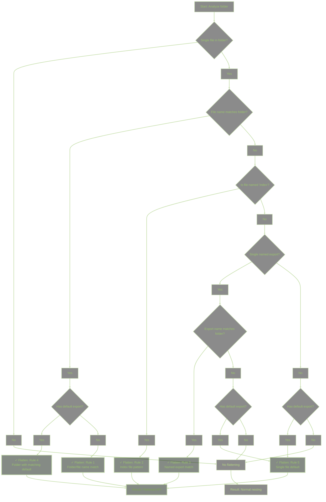

# API Flattening Rules

Slothlet includes intelligent API flattening to create cleaner, more intuitive API structures. This document explains how the flattening system works and when it applies.

## Overview

API flattening automatically removes unnecessary nesting levels when certain patterns are detected. Instead of `api.math.math.add()`, you get `api.math.add()`. The system analyzes your file structure and applies flattening rules to create the most ergonomic API possible.

## Table of Contents

- [The Five Flattening Rules](#the-five-flattening-rules)
- [Decision Tree](#decision-tree)
- [Benefits](#benefits)
- [Examples](#examples)

## The Five Flattening Rules

Slothlet applies five distinct flattening rules to eliminate redundant nesting:

### 1. Folder/File Name Matching

**When:** A folder contains a single file with a matching name (ignoring case and separators)

**Example:**

```text
math/
└── math.mjs → api.math (not api.math.math)
```

**Why:** Having `api.math.math.add()` is redundant when the folder and file names match.

### 2. Index File Pattern

**When:** A folder contains only `index.mjs` or `index.cjs`

**Example:**

```text
utils/
└── index.mjs → api.utils (not api.utils.index)
```

**Why:** Index files are typically used as folder entry points, so the "index" name should be transparent.

### 3. Single Named Export Matching Folder

**When:** A folder has one file, that file has one named export, and the export name matches the folder name

**Example:**

```text
config/
└── settings.mjs
	export const config = {...}
→ api.config (not api.config.settings.config)
```

**Why:** When there's a single export that matches the folder intent, intermediate names add no value.

### 4. Default Export in Matching File

**When:** Folder/file names match AND the file exports a default function/value

**Example:**

```text
logger/
└── logger.mjs
	export default function() {...}
→ api.logger() (not api.logger.logger())
```

**Why:** Default exports typically represent the primary purpose of the module, matching names should flatten.

### 5. Single File with Root-Level Default

**When:** A folder has one file with a default export that should become a top-level callable

**Example:**

```text
processor/
└── process.mjs
	export default function() {...}
→ api.processor() (not api.processor.process())
```

**Why:** When a folder's entire purpose is captured by a single default export, flatten to the folder name.

## Decision Tree



## Benefits

API flattening provides several key benefits:

### 1. Cleaner API Surface

**Without Flattening:**

```javascript
api.math.math.add(2, 3);
api.logger.logger.log("message");
api.config.config.get("key");
```

**With Flattening:**

```javascript
api.math.add(2, 3);
api.logger.log("message");
api.config.get("key");
```

### 2. Intuitive Organization

File structure aligns with API usage:

```text
math/math.mjs → api.math.add()
NOT → api.math.math.add()
```

### 3. Flexibility

Organize files by domain without API penalty:

```text
database/
└── database.mjs → api.database.query()

authentication/
└── index.mjs → api.authentication.login()
```

### 4. Smart Default Handling

Default exports promote to the logical level:

```text
validator/
└── validator.mjs
	export default function validate() {...}
→ api.validator() (callable)
```

## Examples

### Example 1: Math Module

**File Structure:**

```text
api/
└── math/
	└── math.mjs
```

**File Content:**

```javascript
// api/math/math.mjs
export function add(a, b) {
	return a + b;
}

export function subtract(a, b) {
	return a - b;
}
```

**Result:**

```javascript
api.math.add(2, 3); // 5 - Rule 1 applied
api.math.subtract(5, 2); // 3
```

### Example 2: Logger with Default Export

**File Structure:**

```text
api/
└── logger/
	└── logger.mjs
```

**File Content:**

```javascript
// api/logger/logger.mjs
export default function log(message) {
	console.log(message);
}

log.info = (msg) => console.log(`[INFO] ${msg}`);
log.error = (msg) => console.error(`[ERROR] ${msg}`);

export { log };
```

**Result:**

```javascript
api.logger("Hello"); // Rule 4 applied
api.logger.info("Info message");
api.logger.error("Error message");
```

### Example 3: Index File Pattern

**File Structure:**

```text
api/
└── utils/
	└── index.mjs
```

**File Content:**

```javascript
// api/utils/index.mjs
export function format(str) {
	return str.toUpperCase();
}

export function parse(str) {
	return str.toLowerCase();
}
```

**Result:**

```javascript
api.utils.format("hello"); // "HELLO" - Rule 2 applied
api.utils.parse("WORLD"); // "world"
```

### Example 4: Config Module

**File Structure:**

```text
api/
└── config/
	└── settings.mjs
```

**File Content:**

```javascript
// api/config/settings.mjs
export const config = {
	port: 3000,
	host: "localhost"
};
```

**Result:**

```javascript
api.config.port; // 3000 - Rule 3 applied
api.config.host; // "localhost"
```

### Example 5: Processor with Default

**File Structure:**

```text
api/
└── processor/
	└── process.mjs
```

**File Content:**

```javascript
// api/processor/process.mjs
export default function process(data) {
	return data.toUpperCase();
}
```

**Result:**

```javascript
api.processor("hello"); // "HELLO" - Rule 5 applied
```

---

For more information, see:

- [Module Structure Examples](MODULE-STRUCTURE.md) - Comprehensive module patterns
- [API Rules](API-RULES.md) - Complete transformation rules
- [API Rules Conditions](API-RULES-CONDITIONS.md) - Conditional logic reference
- [README](../README.md) - Main project documentation
