# API Flattening Guide (v2)

**User Guide to Intelligent API Structure Generation with Clear Examples and Visual Decision Trees**

- **Version**: 2.0
- **Date**: January 3, 2026
- **Purpose**: User-friendly guide explaining how slothlet transforms file structures into clean, intuitive API surfaces
- **Audience**: Developers using slothlet who want to understand how their code organization becomes an API

---

## Document Hierarchy

This is the **top level** of slothlet's three-tier documentation system:

```text
📋 API-FLATTENING-v2.md (F##)     ← YOU ARE HERE: User-friendly guide
     ↑ links from                  ↓ links to
📊 API-RULES-v2.md (1-12)         ← Maintainer Guide: All API behaviors
     ↑ links from                  ↓ links to
🔧 API-RULES-CONDITIONS-v2.md     ← Developer Guide: Exact source code locations
```

**Navigation:**

- **⬇️ For Maintainers**: See [API-RULES-v2.md](API-RULES-v2.md) for complete behavior catalog with verified examples
- **⬇️ For Developers**: See [API-RULES-CONDITIONS-v2.md](API-RULES-CONDITIONS-v2.md) for exact source code locations

---

## Overview

API flattening automatically removes unnecessary nesting levels when certain patterns are detected. Instead of `api.math.math.add()`, you get `api.math.add()`. The system analyzes your file structure and applies **seven flattening rules** to create the most ergonomic API possible.

**Key Benefits:**

- 🎯 **Cleaner APIs** - Eliminates redundant nesting levels
- 🧠 **Intuitive Structure** - File organization aligns with API usage
- ⚡ **Smart Automation** - No manual configuration required
- 🔧 **Edge Case Handling** - Robust protection against circular references

---

## Table of Contents

- [The Seven Flattening Rules](#the-seven-flattening-rules) (F01-F07)
- [Benefits and Examples](#benefits-and-examples)
- [Advanced Scenarios](#advanced-scenarios)
- [Cross-Reference Guide](#cross-reference-guide)

> **Note**: This document covers the **7 flattening-specific patterns** (F01-F07) which are a subset of the **12 comprehensive API rules** (Rules 1-12) in [API-RULES-v2.md](API-RULES-v2.md). The complete rules cover ALL API behaviors including non-flattening cases.

---

## The Seven Flattening Rules

Slothlet applies seven distinct flattening rules to eliminate redundant nesting. These represent the **flattening-specific subset** of the [12 comprehensive API rules](API-RULES-v2.md):

**Mapping to Comprehensive Rules**:

- **F01** → Rule 1 (Filename Matches Container Flattening)
- **F02** → Rule 7, 8, 10 (Index files, single module patterns, generic filename promotion)
- **F03** → Rule 7 (Single Module Named Export Flattening)
- **F04** → Rule 8 (Single Module Default Export Promotion)
- **F05** → Rule 8 (Single Module Default Export Promotion)
- **F06** → Rule 11 (AddApi Special File Pattern)
- **F07** → Rule 12 (AddApi Root-Level File Matching)

**Non-Flattening Rules** (Rules 2-6, 9): Export handling, mixed exports, function naming, empty modules, self-referential protection.

### F01: Folder/File Name Matching

**When:** A folder contains a single file with a matching name (ignoring case and separators)  
**Result:** File contents promoted to folder level  
**Detailed Coverage**: [API-RULES Rule 1](API-RULES-v2.md#rule-1-filename-matches-container-flattening) | **Technical**: [CONDITIONS C05, C09b](API-RULES-CONDITIONS-v2.md#c05)

**Example:**

```text
math/
└── math.mjs → api.math.add() (not api.math.math.add())
```

```javascript
// File: math/math.mjs
export function add(a, b) {
	return a + b;
}
export function subtract(a, b) {
	return a - b;
}

// ✅ Result: Clean API
api.math.add(2, 3); // 5
api.math.subtract(5, 2); // 3

// ❌ Without F01: Redundant nesting
// api.math.math.add(2, 3)
```

**Why:** Having `api.math.math.add()` is redundant when the folder and file names match. The flattening makes the intent clear while reducing API verbosity.

---

### F02: Index File Pattern

**When:** A folder contains only `index.mjs` or `index.cjs`  
**Result:** Index file becomes transparent, content promoted to folder level  
**Detailed Coverage**: [API-RULES Rule 8 Pattern A](API-RULES-v2.md#pattern-a-index-file-flattening) | **Technical**: [CONDITIONS C12, C21a](API-RULES-CONDITIONS-v2.md#c12)

**Example:**

```text
utils/
└── index.mjs → api.utils.format() (not api.utils.index.format())
```

```javascript
// File: utils/index.mjs
export function format(str) {
	return str.toUpperCase();
}
export function validate(data) {
	return !!data;
}

// ✅ Result: Index transparency
api.utils.format("hello"); // "HELLO"
api.utils.validate(true); // true

// ❌ Without F02: Index noise
// api.utils.index.format("hello")
```

**Why:** Index files are typically used as folder entry points, so the "index" name should be transparent to API consumers. This follows common JavaScript module patterns.

---

### F03: Single Named Export Matching Folder

**When:** A folder has one file, that file has one named export, and the export name matches the folder name  
**Result:** Export contents promoted directly to folder level  
**Detailed Coverage**: [API-RULES Rule 7](API-RULES-v2.md#rule-7-auto-flattening-single-named-export) | **Technical**: [CONDITIONS C04, C09a, C18](API-RULES-CONDITIONS-v2.md#c04)

**Example:**

```text
config/
└── settings.mjs
    export const config = {...}
→ api.config.port (not api.config.settings.config.port)
```

```javascript
// File: config/settings.mjs
export const config = {
	port: 3000,
	host: "localhost",
	debug: true
};

// ✅ Result: Auto-flattened structure
api.config.port; // 3000
api.config.host; // 'localhost'
api.config.debug; // true

// ❌ Without F03: Triple nesting
// api.config.settings.config.port
```

**Why:** When there's a single export that matches the folder intent, intermediate names add no semantic value. The flattening preserves the developer's organizational intent while simplifying access.

---

### F04: Default Export in Matching File

**When:** Folder/file names match AND the file exports a default function/value  
**Result:** Default function becomes callable at folder level with properties attached  
**Detailed Coverage**: [API-RULES Rule 4](API-RULES-v2.md#rule-4-default-export-container-pattern) | **Technical**: [CONDITIONS C08c, C24](API-RULES-CONDITIONS-v2.md#c08c)

**Example:**

```text
logger/
└── logger.mjs
    export default function() {...}
→ api.logger() (not api.logger.logger())
```

```javascript
// File: logger/logger.mjs
export default function logger(message) {
	console.log(`[LOG] ${message}`);
}
logger.info = (msg) => console.log(`[INFO] ${msg}`);
logger.error = (msg) => console.error(`[ERROR] ${msg}`);

// ✅ Result: Callable with properties
api.logger("Hello World"); // Function callable
api.logger.info("Information"); // Named properties accessible
api.logger.error("Error message"); // All properties preserved

// ❌ Without F04: Redundant function nesting
// api.logger.logger("Hello World")
```

**Why:** Default exports typically represent the primary purpose of the module. When names match, flattening creates a more natural callable API while preserving additional properties.

---

### F05: Single File with Root-Level Default

**When:** A folder has one file with a default export that should become a top-level callable  
**Result:** Default export promoted to folder name, becoming a clean API entry point  
**Detailed Coverage**: [API-RULES Rule 8 Pattern C](API-RULES-v2.md#pattern-c-single-default-export) | **Technical**: [CONDITIONS C08c, C11](API-RULES-CONDITIONS-v2.md#c08c)

**Example:**

```text
processor/
└── process.mjs
    export default function() {...}
→ api.processor() (not api.processor.process())
```

```javascript
// File: processor/process.mjs
export default function processor(input) {
	return input.toUpperCase();
}

// ✅ Result: Clean callable API
api.processor("hello"); // "HELLO"

// ❌ Without F05: Redundant process() nesting
// api.processor.process("hello")
```

**Why:** When a folder's entire purpose is captured by a single default export, flattening to the folder name creates the most intuitive API. The folder name becomes the semantic identifier.

---

### F06: AddApi Special File Pattern

**When:** Files named `addapi.mjs` loaded via `addApi()` method  
**Result:** Always flatten regardless of `autoFlatten` setting - designed for seamless API extensions  
**Detailed Coverage**: [API-RULES Rule 11](API-RULES-v2.md#rule-11-addapi-special-file-pattern) | **Technical**: [CONDITIONS C33](API-RULES-CONDITIONS-v2.md#c33)

**Example:**

```text
// Using api.addApi("plugins", "./plugin-folder")
plugin-folder/
└── addapi.mjs
    export function initializePlugin() {...}
    export function cleanup() {...}
→ api.plugins.initializePlugin() (not api.plugins.addapi.initializePlugin())
```

```javascript
// File: plugins/addapi.mjs
export function initializePlugin() {
	console.log("Plugin initialized");
}
export function cleanup() {
	console.log("Plugin cleaned up");
}
export function configure(options) {
	console.log("Plugin configured", options);
}

// AddApi Usage:
await api.addApi("plugins", "./plugin-folder");

// ✅ Result: Seamless API extension
api.plugins.initializePlugin(); // Direct extension
api.plugins.cleanup(); // No .addapi. intermediate level
api.plugins.configure(opts); // Clean integration

// ❌ Without F06: Unwanted addapi namespace
// api.plugins.addapi.initializePlugin()
```

**Special Behavior:**

- ✅ **Always Flattened**: Works regardless of `autoFlatten=false` setting
- ✅ **Runtime Extension**: Perfect for plugin systems and dynamic loading
- ✅ **Priority Processing**: Takes precedence over other flattening rules
- ✅ **API Extension**: Designed to extend existing API levels directly

**Why:** `addapi.mjs` files are specifically designed to extend existing API levels directly. They should never create an intermediate `addapi` namespace, as their purpose is to seamlessly integrate with existing API structures.

---

### F07: AddApi Root-Level File Matching

**When:** Using `addApi()` with module ownership tracking for selective API overwriting  
**Result:** Modules can only overwrite APIs they originally registered, enabling safe hot-reloading  
**Detailed Coverage**: [API-RULES Rule 12](API-RULES-v2.md#rule-12-module-ownership-and-selective-api-overwriting) | **Technical**: [CONDITIONS C19-C22](API-RULES-CONDITIONS-v2.md#c19-c22)

**Example:**

```javascript
// Module A registers plugins with ownership tracking
await api.addApi(
	"plugins.moduleA",
	"./modules/moduleA",
	{},
	{
		moduleId: "moduleA", // Track ownership
		forceOverwrite: true // Override global allowApiOverwrite
	}
);

// Module A hot-reload - only affects APIs it owns
await api.addApi(
	"plugins.moduleA",
	"./modules/moduleA-v2",
	{},
	{
		moduleId: "moduleA",
		forceOverwrite: true // ✅ Allowed - moduleA owns these APIs
	}
);

// Cross-module protection
await api.addApi(
	"plugins.moduleB",
	"./malicious-code",
	{},
	{
		moduleId: "moduleA", // ❌ Error - cannot overwrite moduleB's APIs
		forceOverwrite: true
	}
);
```

```javascript
// Configuration Requirements:
const api = await slothlet({
	hotReload: true // Required for ownership tracking
});

api.config.utils.validate(); // ✅ utils.mjs preserved normally
api.config.config.getNestedConfig(); // ✅ Subdirectory NOT flattened

// ❌ Without F07: Redundant nesting
// api.config.config.getConfig()
```

**Key Points:**

- ✅ **Root-level only**: Only applies to files at the immediate root of the folder being added
- ✅ **Subdirectories preserved**: Files in subdirectories follow normal flattening rules
- ✅ **AddApi specific**: This rule is specific to `addApi()` operations
- ✅ **Path segment matching**: Only the final segment of the API path is considered
- ✅ **Always active**: Works regardless of `autoFlatten` setting

**Why:** When the API path segment matches a root-level file name, flattening eliminates redundant nesting while preserving clear organization for subdirectories. This enables clean API extensions while maintaining structure.

---

## Visual Decision Tree

```mermaid
flowchart TD
	A[Start: Analyze folder] --> AA{File named 'addapi'?}
	AA --> AAYES[Yes] --> AAResult[✓ Flatten: F06<br/>AddApi special pattern]
	AA --> AANO[No] --> B{Single file in folder?}

	B --> BNO[No] --> Z[No flattening]
	B --> BYES[Yes] --> C{File name matches folder?}

	C --> CYES[Yes] --> D{Has default export?}
	D --> DYES[Yes] --> E[✓ Flatten: F04<br/>Default in matching file]
	D --> DNO[No] --> F[✓ Flatten: F01<br/>Folder/file name match]

	C --> CNO[No] --> G{Is file named 'index'?}
	G --> GYES[Yes] --> H[✓ Flatten: F02<br/>Index file pattern]
	G --> GNO[No] --> I{Single named export?}

	I --> IYES[Yes] --> J{Export name matches folder?}
	J --> JYES[Yes] --> K[✓ Flatten: F03<br/>Named export match]
	J --> JNO[No] --> L{Has default export?}

	L --> LYES[Yes] --> M[✓ Flatten: F05<br/>Single file default]
	L --> LNO[No] --> Z

	I --> INO[No] --> N{Has default export?}
	N --> NYES[Yes] --> M
	N --> NNO[No] --> Z

	AAResult --> O[Result: Flattened API]
	E --> O
	F --> O
	H --> O
	K --> O
	M --> O
	Z --> P[Result: Normal nesting]

	%% Slothlet brand colors - #9BC66B primary on dark theme
	style A fill:#1a1a1a,stroke:#9BC66B,stroke-width:2px,color:#9BC66B,opacity:0.5
	style AA fill:#1a1a1a,stroke:#9BC66B,stroke-width:2px,color:#9BC66B,opacity:0.5
	style B fill:#1a1a1a,stroke:#9BC66B,stroke-width:2px,color:#9BC66B,opacity:0.5
	style C fill:#1a1a1a,stroke:#9BC66B,stroke-width:2px,color:#9BC66B,opacity:0.5
	style D fill:#1a1a1a,stroke:#9BC66B,stroke-width:2px,color:#9BC66B,opacity:0.5
	style G fill:#1a1a1a,stroke:#9BC66B,stroke-width:2px,color:#9BC66B,opacity:0.5
	style I fill:#1a1a1a,stroke:#9BC66B,stroke-width:2px,color:#9BC66B,opacity:0.5
	style J fill:#1a1a1a,stroke:#9BC66B,stroke-width:2px,color:#9BC66B,opacity:0.5
	style L fill:#1a1a1a,stroke:#9BC66B,stroke-width:2px,color:#9BC66B,opacity:0.5
	style N fill:#1a1a1a,stroke:#9BC66B,stroke-width:2px,color:#9BC66B,opacity:0.5

	%% Yes/No nodes - styled boxes
	style AAYES fill:#1a1a1a,stroke:#9BC66B,stroke-width:2px,color:#9BC66B,opacity:0.5
	style AANO fill:#1a1a1a,stroke:#9BC66B,stroke-width:2px,color:#9BC66B,opacity:0.5
	style BNO fill:#1a1a1a,stroke:#9BC66B,stroke-width:2px,color:#9BC66B,opacity:0.5
	style BYES fill:#1a1a1a,stroke:#9BC66B,stroke-width:2px,color:#9BC66B,opacity:0.5
	style CYES fill:#1a1a1a,stroke:#9BC66B,stroke-width:2px,color:#9BC66B,opacity:0.5
	style CNO fill:#1a1a1a,stroke:#9BC66B,stroke-width:2px,color:#9BC66B,opacity:0.5
	style DYES fill:#1a1a1a,stroke:#9BC66B,stroke-width:2px,color:#9BC66B,opacity:0.5
	style DNO fill:#1a1a1a,stroke:#9BC66B,stroke-width:2px,color:#9BC66B,opacity:0.5
	style GYES fill:#1a1a1a,stroke:#9BC66B,stroke-width:2px,color:#9BC66B,opacity:0.5
	style GNO fill:#1a1a1a,stroke:#9BC66B,stroke-width:2px,color:#9BC66B,opacity:0.5
	style IYES fill:#1a1a1a,stroke:#9BC66B,stroke-width:2px,color:#9BC66B,opacity:0.5
	style INO fill:#1a1a1a,stroke:#9BC66B,stroke-width:2px,color:#9BC66B,opacity:0.5
	style JYES fill:#1a1a1a,stroke:#9BC66B,stroke-width:2px,color:#9BC66B,opacity:0.5
	style JNO fill:#1a1a1a,stroke:#9BC66B,stroke-width:2px,color:#9BC66B,opacity:0.5
	style LYES fill:#1a1a1a,stroke:#9BC66B,stroke-width:2px,color:#9BC66B,opacity:0.5
	style LNO fill:#1a1a1a,stroke:#9BC66B,stroke-width:2px,color:#9BC66B,opacity:0.5
	style NYES fill:#1a1a1a,stroke:#9BC66B,stroke-width:2px,color:#9BC66B,opacity:0.5
	style NNO fill:#1a1a1a,stroke:#9BC66B,stroke-width:2px,color:#9BC66B,opacity:0.5

	%% Success states - primary green
	style AAResult fill:#0d1a0d,stroke:#9BC66B,stroke-width:3px,color:#9BC66B,opacity:0.5
	style E fill:#0d1a0d,stroke:#9BC66B,stroke-width:3px,color:#9BC66B,opacity:0.5
	style F fill:#0d1a0d,stroke:#9BC66B,stroke-width:3px,color:#9BC66B,opacity:0.5
	style H fill:#0d1a0d,stroke:#9BC66B,stroke-width:3px,color:#9BC66B,opacity:0.5
	style K fill:#0d1a0d,stroke:#9BC66B,stroke-width:3px,color:#9BC66B,opacity:0.5
	style M fill:#0d1a0d,stroke:#9BC66B,stroke-width:3px,color:#9BC66B,opacity:0.5

	%% Results - accent colors
	style O fill:#0d1a0d,stroke:#7FA94F,stroke-width:3px,color:#7FA94F,opacity:0.5
	style P fill:#1a1a1a,stroke:#B8D982,stroke-width:2px,color:#B8D982,opacity:0.5
	style Z fill:#1a1a1a,stroke:#B8D982,stroke-width:2px,color:#B8D982,opacity:0.5

	%% Arrow styling
	linkStyle default stroke:#9BC66B,stroke-width:3px,opacity:0.5

    %% Styling with slothlet brand colors (#9BC66B primary)
    style A fill:#1a1a1a,stroke:#9BC66B,stroke-width:2px,color:#9BC66B
    style AA fill:#1a1a1a,stroke:#9BC66B,stroke-width:2px,color:#9BC66B
    style AB fill:#1a1a1a,stroke:#9BC66B,stroke-width:2px,color:#9BC66B
    style B fill:#1a1a1a,stroke:#9BC66B,stroke-width:2px,color:#9BC66B
    style C fill:#1a1a1a,stroke:#9BC66B,stroke-width:2px,color:#9BC66B
    style D fill:#1a1a1a,stroke:#9BC66B,stroke-width:2px,color:#9BC66B
    style G fill:#1a1a1a,stroke:#9BC66B,stroke-width:2px,color:#9BC66B
    style I fill:#1a1a1a,stroke:#9BC66B,stroke-width:2px,color:#9BC66B
    style J fill:#1a1a1a,stroke:#9BC66B,stroke-width:2px,color:#9BC66B
    style L fill:#1a1a1a,stroke:#9BC66B,stroke-width:2px,color:#9BC66B
    style N fill:#1a1a1a,stroke:#9BC66B,stroke-width:2px,color:#9BC66B

    %% Decision nodes
    style AAYES fill:#1a1a1a,stroke:#9BC66B,stroke-width:2px,color:#9BC66B
    style AANO fill:#1a1a1a,stroke:#9BC66B,stroke-width:2px,color:#9BC66B
    style ABYES fill:#1a1a1a,stroke:#9BC66B,stroke-width:2px,color:#9BC66B
    style ABNO fill:#1a1a1a,stroke:#9BC66B,stroke-width:2px,color:#9BC66B
    style BNO fill:#1a1a1a,stroke:#9BC66B,stroke-width:2px,color:#9BC66B
    style BYES fill:#1a1a1a,stroke:#9BC66B,stroke-width:2px,color:#9BC66B
    style CYES fill:#1a1a1a,stroke:#9BC66B,stroke-width:2px,color:#9BC66B
    style CNO fill:#1a1a1a,stroke:#9BC66B,stroke-width:2px,color:#9BC66B
    style DYES fill:#1a1a1a,stroke:#9BC66B,stroke-width:2px,color:#9BC66B
    style DNO fill:#1a1a1a,stroke:#9BC66B,stroke-width:2px,color:#9BC66B
    style GYES fill:#1a1a1a,stroke:#9BC66B,stroke-width:2px,color:#9BC66B
    style GNO fill:#1a1a1a,stroke:#9BC66B,stroke-width:2px,color:#9BC66B
    style IYES fill:#1a1a1a,stroke:#9BC66B,stroke-width:2px,color:#9BC66B
    style INO fill:#1a1a1a,stroke:#9BC66B,stroke-width:2px,color:#9BC66B
    style JYES fill:#1a1a1a,stroke:#9BC66B,stroke-width:2px,color:#9BC66B
    style JNO fill:#1a1a1a,stroke:#9BC66B,stroke-width:2px,color:#9BC66B
    style LYES fill:#1a1a1a,stroke:#9BC66B,stroke-width:2px,color:#9BC66B
    style LNO fill:#1a1a1a,stroke:#9BC66B,stroke-width:2px,color:#9BC66B
    style NYES fill:#1a1a1a,stroke:#9BC66B,stroke-width:2px,color:#9BC66B
    style NNO fill:#1a1a1a,stroke:#9BC66B,stroke-width:2px,color:#9BC66B

    %% Success states - primary green
    style E fill:#0d1a0d,stroke:#9BC66B,stroke-width:3px,color:#9BC66B
    style F fill:#0d1a0d,stroke:#9BC66B,stroke-width:3px,color:#9BC66B
    style H fill:#0d1a0d,stroke:#9BC66B,stroke-width:3px,color:#9BC66B
    style K fill:#0d1a0d,stroke:#9BC66B,stroke-width:3px,color:#9BC66B
    style M fill:#0d1a0d,stroke:#9BC66B,stroke-width:3px,color:#9BC66B
    style AAResult fill:#0d1a0d,stroke:#9BC66B,stroke-width:3px,color:#9BC66B
    style ABResult fill:#0d1a0d,stroke:#9BC66B,stroke-width:3px,color:#9BC66B

    %% Results - accent colors
    style O fill:#0d1a0d,stroke:#7FA94F,stroke-width:3px,color:#7FA94F
    style P fill:#1a1a1a,stroke:#B8D982,stroke-width:2px,color:#B8D982
    style Z fill:#1a1a1a,stroke:#B8D982,stroke-width:2px,color:#B8D982
```



**Decision Tree Logic:**

1. **F06 Priority**: Always check for `addapi.mjs` files first (special case)
2. **F07 AddApi**: Check for AddApi root-level file matching
3. **F01 & F04**: Folder/file name matching (with default export distinction)
4. **F02**: Index file transparency
5. **F03**: Single named export auto-flattening
6. **F05**: Single file default export promotion
7. **Default**: No flattening when no rules match

---

## Benefits and Examples

### 1. Cleaner API Surface

**Without Flattening:**

```javascript
api.math.math.add(2, 3); // Redundant nesting
api.logger.logger.log("message"); // Repetitive names
api.config.config.get("key"); // Triple nesting
api.utils.index.format("text"); // Index noise
```

**With Flattening:**

```javascript
api.math.add(2, 3); // Clean and direct
api.logger.log("message"); // Natural callable
api.config.get("key"); // Logical access
api.utils.format("text"); // Index transparency
```

### 2. Intuitive Organization

File structure aligns perfectly with API usage patterns:

```text
✅ Well-Organized Structure:
math/math.mjs           → api.math.add()
authentication/index.mjs → api.authentication.login()
plugins/addapi.mjs      → api.plugins.initialize()

✅ Natural API Usage:
api.math.add(1, 2)                    // Mathematical operations
api.authentication.login(credentials) // Authentication flows
api.plugins.initialize()              // Plugin management
```

### 3. Flexible File Organization

Organize by domain without API penalties:

```text
File Structure (Implementation Details):
database/
├── connection.mjs     → api.database.connection.open()
├── query.mjs         → api.database.query.select()
└── database.mjs      → api.database.connect() [F01 flattened]

Plugin Structure (Extensions):
plugins/
├── addapi.mjs        → api.plugins.load() [F06 always flattened]
├── auth.mjs          → api.plugins.auth.authenticate()
└── cache.mjs         → api.plugins.cache.get()
```

### 4. Smart Default Handling

Default exports promote to logical levels:

```text
Callable Functions:
validator/validator.mjs → api.validator() [F04 - callable with properties]
processor/index.mjs     → api.processor() [F02 + F05 - index transparency + default]
logger/logger.mjs       → api.logger() [F04 - function with methods]

Object Structures:
config/settings.mjs     → api.config.* [F03 - auto-flattened object]
constants/index.mjs     → api.constants.* [F02 - index file collection]
```

---

## Advanced Scenarios

### Multi-File Directory Handling

**Complex Structure:**

```text
authentication/
├── index.mjs          [F02 - Index transparency]
├── providers.mjs      [Standard namespace]
├── tokens.mjs         [Standard namespace]
└── utils.mjs          [Standard namespace]
```

**Result:**

```javascript
// Index file flattened (F02)
api.authentication.login(); // From index.mjs
api.authentication.logout(); // From index.mjs

// Other files preserve namespaces
api.authentication.providers.google(); // From providers.mjs
api.authentication.tokens.validate(); // From tokens.mjs
api.authentication.utils.hash(); // From utils.mjs
```

### AddApi Extension Patterns

**Plugin System Example:**

```text
Core API:
api.database.connect()
api.authentication.login()

Plugin Extensions (AddApi):
plugins/database/addapi.mjs  → api.database.migrate() [F06]
plugins/auth/addapi.mjs      → api.authentication.sso() [F06]
```

**Result:**

```javascript
// Core functionality
api.database.connect(); // Original API
api.authentication.login(); // Original API

// Seamless extensions (F06)
api.database.migrate(); // Added by plugin (no .addapi.)
api.authentication.sso(); // Added by plugin (clean integration)
```

### Mixed Export Scenarios

**Function + Properties Pattern:**

```text
logger/logger.mjs:
export default function logger() {...}
logger.info = function() {...}
logger.error = function() {...}
```

**Result (F04):**

```javascript
api.logger("message"); // Default function callable
api.logger.info("info"); // Named properties accessible
api.logger.error("error"); // Complete function+properties API
```

### Edge Case Protection

**Self-Referential Protection:**

```text
math/math.mjs:
export const math = {
    add: (a,b) => a+b,
    math: { nested: "object" }  // Self-referential
}
```

**Result (Protection Active):**

```javascript
// Preserved as namespace (no flattening)
api.math.math.add(1, 2); // Structure preserved to avoid confusion
api.math.math.math.nested; // Self-referential structure clear
```

**Cross-Reference**: [API-RULES Rule 6](API-RULES-v2.md#rule-6-self-referential-export-protection) | **Technical**: [CONDITIONS C01](API-RULES-CONDITIONS-v2.md#c01)

---

## Cross-Reference Guide

### Quick Navigation

| **For This Information**            | **Go To**                                                                           | **Focus**             |
| ----------------------------------- | ----------------------------------------------------------------------------------- | --------------------- |
| Complete rule catalog with examples | [API-RULES-v2.md](API-RULES-v2.md)                                                  | Maintainer reference  |
| Exact source code locations         | [API-RULES-CONDITIONS-v2.md](API-RULES-CONDITIONS-v2.md)                            | Technical debugging   |
| Verification status and test files  | [API-RULES-v2.md#verification-status](API-RULES-v2.md#verification-status)          | Implementation status |
| Advanced multi-default handling     | [API-RULES-v2.md#rule-5](API-RULES-v2.md#rule-5-multi-default-export-mixed-pattern) | Complex scenarios     |

### Rule Cross-References

| Flattening Rule | API Rules                                                                                                | Technical Conditions                             | Test Verification                  |
| --------------- | -------------------------------------------------------------------------------------------------------- | ------------------------------------------------ | ---------------------------------- |
| **F01**         | [Rule 1](API-RULES-v2.md#rule-1)                                                                         | [C05, C09b](API-RULES-CONDITIONS-v2.md#c05)      | api_tests/api_test                 |
| **F02**         | [Rule 8 Pattern A](API-RULES-v2.md#pattern-a-index-file-flattening)                                      | [C12, C21a](API-RULES-CONDITIONS-v2.md#c12)      | Multiple test files                |
| **F03**         | [Rule 7](API-RULES-v2.md#rule-7)                                                                         | [C04, C09a, C18](API-RULES-CONDITIONS-v2.md#c04) | api_tests/api_test                 |
| **F04**         | [Rule 4](API-RULES-v2.md#rule-4), [Rule 8 Pattern B](API-RULES-v2.md#pattern-b-default-export-promotion) | [C08c, C24](API-RULES-CONDITIONS-v2.md#c08c)     | api_tests/api_test + api_tv_test   |
| **F05**         | [Rule 8 Pattern C](API-RULES-v2.md#pattern-c-single-default-export)                                      | [C08c, C11](API-RULES-CONDITIONS-v2.md#c08c)     | Multiple test files                |
| **F06**         | [Rule 11](API-RULES-v2.md#rule-11)                                                                       | [C33](API-RULES-CONDITIONS-v2.md#c33)            | api_tests/api_smart_flatten_addapi |
| **F07**         | [Rule 12](API-RULES-v2.md#rule-12) (related)                                                             | [C19-C22](API-RULES-CONDITIONS-v2.md#c19-c22)    | tests/test-rule-12.mjs             |

### Implementation Status

| Rule    | Status                   | Verification                | Implementation Notes                |
| ------- | ------------------------ | --------------------------- | ----------------------------------- |
| F01-F06 | ✅ **Fully Implemented** | ✅ Verified with test files | Production ready                    |
| F07     | ✅ **Fully Implemented** | ✅ Verified with test files | Rule 12 ownership tracking complete |

---

## Configuration Options

### Global Flattening Control

```javascript
// Enable/disable auto-flattening globally
const api = await slothlet({
	dir: "./api",
	autoFlatten: true // Default: true (recommended)
});

// Disable flattening (not recommended for most use cases)
const api = await slothlet({
	dir: "./api",
	autoFlatten: false // All rules disabled except F06 (addapi.mjs)
});
```

**Note**: F06 (AddApi special files) always flatten regardless of `autoFlatten` setting.

### AddApi-Specific Behavior

```javascript
// AddApi operations respect flattening rules
await api.addApi("plugins", "./plugin-folder");

// F06: addapi.mjs files always flatten
// F07: Root-level file matching applies
// Other rules work normally within the added folder
```

---

## Document Maintenance

**Version**: 2.0  
**Last Review**: January 3, 2026  
**Examples Verified**: All examples tested against current implementation  
**Cross-References**: Enhanced linking to maintainer and technical documentation  
**Visual Design**: Updated decision tree with complete F01-F07 coverage

**Update Triggers**:

- Changes to flattening behavior in source code
- New test cases demonstrating edge cases
- User feedback about documentation clarity
- Implementation of F07 (AddApi root-level matching) completion

**Audience Feedback Welcome**:

- 📧 **Clarity Issues**: Report confusing explanations or missing examples
- 🐛 **Accuracy Problems**: Report examples that don't match actual behavior
- 💡 **Enhancement Ideas**: Suggest additional examples or use cases
- 🔗 **Cross-Reference Issues**: Report broken or confusing links to other documentation
