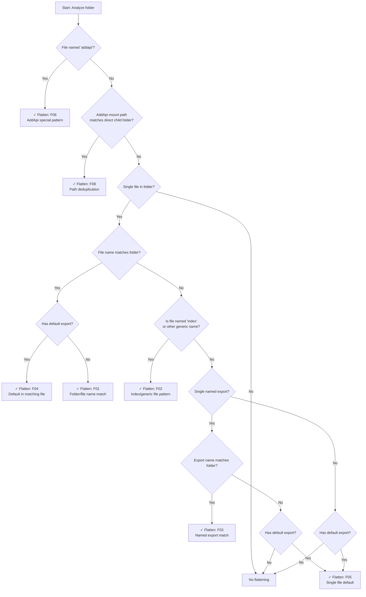

# API Flattening Guide

**User Guide to Intelligent API Structure Generation**

---

## Document Hierarchy

This is the **top level** of slothlet's three-tier documentation system:

```text
📋 API-RULES/API-FLATTENING.md (F##)     ← YOU ARE HERE: User-friendly guide
          ↑ links from                        ↓ links to
📊 API-RULES.md (1-13)                   ← Maintainer Guide: All API behaviors
          ↑ links from                        ↓ links to
🔧 API-RULES/API-RULES-CONDITIONS.md     ← Developer Guide: Exact source code locations
                                              ↓ mapped in
🗺️ API-RULES/API-RULE-MAPPING.md         ← Traceability Matrix: Rule # ↔ F## ↔ C##
```

**Navigation:**

- **For Maintainers**: See [../API-RULES.md](../API-RULES.md) for complete behavior catalog with verified examples
- **For Developers**: See [API-RULES-CONDITIONS.md](API-RULES-CONDITIONS.md) for exact source code locations
- **Rule Mapping**: See [API-RULE-MAPPING.md](API-RULE-MAPPING.md) for complete Rule # ↔ F## ↔ C## traceability matrix

---

## Overview

API flattening automatically removes unnecessary nesting levels when certain patterns are detected. Instead of `api.math.math.add()`, you get `api.math.add()`. The system analyzes your file structure and applies **eight flattening patterns** to create the most ergonomic API possible.

**Key Benefits:**

- Cleaner APIs - eliminates redundant nesting levels
- Intuitive structure - file organization aligns with API usage
- Smart automation - no manual configuration required
- Robust edge case handling - protection against circular references

---

## Table of Contents

- [The Eight Flattening Patterns](#the-eight-flattening-patterns)
- [Visual Decision Tree](#visual-decision-tree)
- [Benefits and Examples](#benefits-and-examples)
- [Advanced Scenarios](#advanced-scenarios)
- [Cross-Reference Guide](#cross-reference-guide)

> This document covers the **8 flattening-specific patterns** (F01-F08) which are a subset of the **13 comprehensive API rules** (Rules 1-13) in [../API-RULES.md](../API-RULES.md). The complete rules cover all API behaviors including non-flattening cases.

---

## The Eight Flattening Patterns

### Mapping to Comprehensive Rules

- **F01** → Rule 1 (Filename Matches Container Flattening)
- **F02** → Rules 7, 8, 10 (Index files, single module patterns, generic filename promotion)
- **F03** → Rule 7 (Single Module Named Export Flattening)
- **F04** → Rule 8 (Single Module Default Export Promotion - matching filename)
- **F05** → Rule 8 (Single Module Default Export Promotion - any filename)
- **F06** → Rule 11 (AddApi Special File Pattern)
- **F07** → Rule 12 (Module Ownership and Selective API Overwriting)
- **F08** → Rule 13 (AddApi Path Deduplication Flattening)

**Non-Flattening Rules** (Rules 2-6, 9): Export handling, mixed exports, function naming, empty modules, self-referential protection.

---

### F01: Folder/File Name Matching

**When:** A file's name matches its containing folder name  
**Result:** File contents promoted to folder level - no intermediate namespace  
**Detailed Coverage**: [API-RULES Rule 1](../API-RULES.md#rule-1-filename-matches-container-flattening) | **Technical**: [C05, C09b](API-RULES-CONDITIONS.md#c05-filename-matches-container-category-level-flatten)

**Example:**

```text
math/
└── math.mjs → api.math.add()  (not api.math.math.add())
```

```javascript
// File: math/math.mjs
export function add(a, b) { return a + b; }
export function subtract(a, b) { return a - b; }

api.math.add(2, 3);      // ✅ 5
api.math.subtract(5, 2); // ✅ 3
// NOT: api.math.math.add(2, 3) ❌
```

**Why:** Having `api.math.math.add()` is redundant when folder and file names match.

---

### F02: Index File Pattern

**When:** A folder contains only `index.mjs` (or common generic filenames such as `main`, `default`)  
**Result:** Index file becomes transparent; content promoted to folder level  
**Detailed Coverage**: [API-RULES Rule 8](../API-RULES.md#rule-8-single-module-default-export-promotion) / [Rule 10](../API-RULES.md#rule-10-generic-filename-parent-level-promotion) | **Technical**: [C12, C21a](API-RULES-CONDITIONS.md#c12-object-auto-flatten)

**Example:**

```text
utils/
└── index.mjs → api.utils.format()  (not api.utils.index.format())
```

```javascript
// File: utils/index.mjs
export function format(str) { return str.toUpperCase(); }
export function validate(data) { return !!data; }

api.utils.format("hello"); // ✅ "HELLO"
api.utils.validate(true);  // ✅ true
// NOT: api.utils.index.format("hello") ❌
```

**Why:** Index files are folder entry points - the `index` name should be transparent to API consumers. Same applies to other generic names like `main` and `default`.

---

### F03: Single Named Export Matching Folder

**When:** A folder has one file, that file has one named export, and that export name matches the folder name  
**Result:** Export contents promoted directly to folder level  
**Detailed Coverage**: [API-RULES Rule 7](../API-RULES.md#rule-7-single-module-named-export-flattening) | **Technical**: [C04, C09a, C18](API-RULES-CONDITIONS.md#c04-auto-flatten-single-named-export-matching-filename)

**Example:**

```text
config/
└── settings.mjs
    export const config = { port: 3000, ... }
→ api.config.port  (not api.config.settings.config.port)
```

```javascript
// File: config/settings.mjs
export const config = { port: 3000, host: "localhost", debug: true };

api.config.port;  // ✅ 3000
api.config.host;  // ✅ "localhost"
// NOT: api.config.settings.config.port ❌
```

**Why:** When there's a single export that matches the folder intent, intermediate names add no semantic value.

---

### F04: Default Export in Matching File

**When:** Folder and file names match AND the file has a default export  
**Result:** Default function becomes callable at folder level; other properties attach to it  
**Detailed Coverage**: [API-RULES Rule 8](../API-RULES.md#rule-8-single-module-default-export-promotion) | **Technical**: [C08c, C24](API-RULES-CONDITIONS.md#c08-auto-flattening)

**Example:**

```text
logger/
└── logger.mjs
    export default function logger() {...}
→ api.logger()  (not api.logger.logger())
```

```javascript
// File: logger/logger.mjs
export default function logger(message) {
	console.log(`[LOG] ${message}`);
}

api.logger("Hello World"); // ✅ callable
// NOT: api.logger.logger("Hello World") ❌

// Additional files in the folder become properties on the function:
api.logger.utils.debug("x"); // utils.mjs still accessible
```

**Why:** When names match and there's a default export, the function becomes the namespace itself.

---

### F05: Single File with Root-Level Default

**When:** A folder has one file with a default export (filenames need not match)  
**Result:** Default export promoted to folder name as a clean callable entry point  
**Detailed Coverage**: [API-RULES Rule 8](../API-RULES.md#rule-8-single-module-default-export-promotion) | **Technical**: [C08c, C11](API-RULES-CONDITIONS.md#c11-default-export-flattening)

**Example:**

```text
processor/
└── process.mjs
    export default function() {...}
→ api.processor()  (not api.processor.process())
```

```javascript
// File: processor/process.mjs
export default function processor(input) { return input.toUpperCase(); }

api.processor("hello"); // ✅ "HELLO"
// NOT: api.processor.process("hello") ❌
```

**Why:** When a folder's entire purpose is captured by a single default export, the folder name becomes the semantic identifier.

---

### F06: AddApi Special File Pattern

**When:** A file named `addapi.mjs` is loaded via `api.slothlet.api.add()`  
**Result:** Always flattened to the mount namespace - never creates an intermediate `addapi` level  
**Detailed Coverage**: [API-RULES Rule 11](../API-RULES.md#rule-11-addapi-special-file-pattern) | **Technical**: [C33](API-RULES-CONDITIONS.md#c33-addapi-special-file-detection)

**Example:**

```text
plugin-folder/
└── addapi.mjs
    export function initializePlugin() {...}
    export function cleanup() {...}
→ api.plugins.initializePlugin()  (not api.plugins.addapi.initializePlugin())
```

```javascript
// File: plugin-folder/addapi.mjs
export function initializePlugin() { console.log("Plugin initialized"); }
export function cleanup() { console.log("Plugin cleaned up"); }

await api.slothlet.api.add("plugins", "./plugin-folder");

api.plugins.initializePlugin(); // ✅ Always flattened
api.plugins.cleanup();          // ✅
// NOT: api.plugins.addapi.initializePlugin() ❌
```

**Special Behavior:** `addapi.mjs` exports are always flattened regardless of other configuration. This pattern is specifically designed to extend existing API namespaces directly.

**Why:** These files are designed to seamlessly integrate with existing API structures. An intermediate `addapi` namespace defeats their purpose.

---

### F07: Module Ownership Tracking

**When:** Using `api.slothlet.api.add()` with a `moduleId` to track which module owns which API paths  
**Result:** Modules can only overwrite APIs they originally registered; removing a module restores the previous owner  
**Detailed Coverage**: [API-RULES Rule 12](../API-RULES.md#rule-12-module-ownership-and-selective-api-overwriting) | **Technical**: [C19-C22](API-RULES-CONDITIONS.md#c19)

**Example:**

```javascript
// Module A and B coexist in same namespace
await api.slothlet.api.add("plugins.moduleA", "./modules/moduleA", {}, { moduleId: "moduleA" });
await api.slothlet.api.add("plugins.moduleB", "./modules/moduleB", {}, { moduleId: "moduleB" });

// Hot-reload module A - only its own paths are updated
await api.slothlet.api.add("plugins.moduleA", "./modules/moduleA-v2", {}, {
	moduleId: "moduleA",
	forceOverwrite: true  // ✅ Allowed - moduleA owns these paths
});

// Cross-module protection - blocked in "error" collision mode
await api.slothlet.api.add("plugins.moduleB", "./other", {}, {
	moduleId: "moduleA",  // moduleA does not own moduleB's paths
	forceOverwrite: true  // ❌ OWNERSHIP_CONFLICT thrown
});
```

**Stack-Based History:** Each path maintains an ownership stack. Removing a module rolls back to its previous owner automatically.

**Why:** Enables safe hot-reloading where independent modules can coexist and reload without interfering with each other.

---

### F08: AddApi Path Deduplication Flattening

> **New in v3**

**When:** `api.slothlet.api.add("name", folder)` is called and the folder directly contains a subfolder whose name matches the mount path's last segment  
**Result:** The matching subfolder's exports are hoisted to the mount namespace, preventing double-nesting  
**Detailed Coverage**: [API-RULES Rule 13](../API-RULES.md#rule-13-addapi-path-deduplication-flattening) | **Technical**: [C34](API-RULES-CONDITIONS.md#c34-addapi-path-deduplication)

**Example:**

```text
api_smart_flatten_folder_config/
├── main.mjs          ← exports getRootInfo, setRootConfig
└── config/
    └── config.mjs    ← exports getNestedConfig, setNestedConfig

api.slothlet.api.add("config", "./api_smart_flatten_folder_config")
→ api.config.getNestedConfig()  (not api.config.config.getNestedConfig())
```

```javascript
await api.slothlet.api.add("config", "./api_smart_flatten_folder_config", {});

api.config.getNestedConfig();    // ✅ hoisted
api.config.setNestedConfig();    // ✅ hoisted
api.config.main.getRootInfo();   // ✅ other files unaffected
// NOT: api.config.config.getNestedConfig() ❌
```

**Guard - Direct Child Only:** Rule only applies when the matching subfolder is a **direct child** of the mounted folder. Deeper nesting (e.g. `folder/config/config/config.mjs`) is intentional and not flattened.

**Why:** When you mount a folder at a path named `config`, a direct `config/config.mjs` inside it would create redundant `api.config.config.*` nesting.

---

## Visual Decision Tree



**Decision Tree Logic:**

1. **F06 Priority**: Always check for `addapi.mjs` files first - special case
2. **F08 Check**: AddApi path deduplication (direct subfolder match)
3. **F01 & F04**: Folder/file name matching (with and without default export)
4. **F02**: Index / generic filename transparency
5. **F03**: Single named export matching folder
6. **F05**: Single file default export promotion
7. **Default**: No flattening when no rules match

---

## Benefits and Examples

### Cleaner API Surface

```javascript
// Without flattening:
api.math.math.add(2, 3);
api.utils.index.format("text");
api.config.settings.DATABASE_URL;

// With flattening:
api.math.add(2, 3);
api.utils.format("text");
api.config.DATABASE_URL;
```

### Intuitive Organization

File structure aligns with API usage patterns. Organize by domain without API penalties:

```text
math/math.mjs           → api.math.add()
authentication/index.mjs → api.authentication.login()
plugins/addapi.mjs      → api.plugins.initialize()
```

### Smart Default Handling

```text
Callable functions (F04):
logger/logger.mjs → api.logger()      ← callable, with properties

Auto-flattened objects (F03):
config/settings.mjs → api.config.*   ← object spread to parent level

Index transparency (F02):
utils/index.mjs → api.utils.*        ← index name disappears
```

### Plugin System Pattern

```javascript
// Core API
api.database.connect();

// Extend seamlessly with addapi.mjs (F06)
await api.slothlet.api.add("database", "./database-plugins");
// plugin-folder/addapi.mjs exports:
api.database.migrate();  // ✅ No intermediate addapi namespace
api.database.seed();     // ✅
```

---

## Advanced Scenarios

### Multi-File Directory Handling

When a folder has multiple files, only files that match specific patterns flatten. Others keep their namespace:

```text
authentication/
├── index.mjs     [F02 - transparent]
├── providers.mjs [standard namespace]
└── tokens.mjs    [standard namespace]
```

```javascript
api.authentication.login();             // From index.mjs (F02)
api.authentication.providers.google();  // From providers.mjs
api.authentication.tokens.validate();   // From tokens.mjs
```

### Callable Namespace with Properties

When a folder/file match with a default export (F04), the function itself becomes the namespace and other files attach as properties:

```javascript
// File: logger/logger.mjs
export default function logger(msg) { ... }

// File: logger/utils.mjs
export function debug(msg) { ... }

api.logger("message");       // Default function callable
api.logger.utils.debug("x"); // Other files still accessible
```

### Self-Referential Protection

When a module exports an object that contains a key matching the filename/namespace, no flattening occurs to avoid confusing infinite-looking structures. See [API-RULES Rule 6](../API-RULES.md#rule-6-multiple-module-mixed-exports) and [C01](API-RULES-CONDITIONS.md#c01-self-referential-check).

---

## Cross-Reference Guide

### Quick Navigation

| For This Information | Go To | Focus |
| -------------------- | ----- | ----- |
| Complete rule catalog with examples | [../API-RULES.md](../API-RULES.md) | Maintainer reference |
| Exact source code locations | [API-RULES-CONDITIONS.md](API-RULES-CONDITIONS.md) | Technical debugging |
| Verification status and test files | [../API-RULES.md#verification-status](../API-RULES.md#verification-status) | Implementation status |
| Traceability matrix | [API-RULE-MAPPING.md](API-RULE-MAPPING.md) | Rule ↔ F## ↔ C## |

### Pattern Cross-References

| Pattern | API Rules | Technical Conditions | Test Verification |
| ------- | --------- | -------------------- | ----------------- |
| **F01** | [Rule 1](../API-RULES.md#rule-1-filename-matches-container-flattening) | [C05, C09b](API-RULES-CONDITIONS.md#c05-filename-matches-container-category-level-flatten) | `api_tests/api_test` |
| **F02** | [Rule 8](../API-RULES.md#rule-8-single-module-default-export-promotion), [Rule 10](../API-RULES.md#rule-10-generic-filename-parent-level-promotion) | [C12, C21a](API-RULES-CONDITIONS.md#c12-object-auto-flatten) | Multiple test files |
| **F03** | [Rule 7](../API-RULES.md#rule-7-single-module-named-export-flattening) | [C04, C09a, C18](API-RULES-CONDITIONS.md#c04-auto-flatten-single-named-export-matching-filename) | `api_tests/api_test` |
| **F04** | [Rule 8](../API-RULES.md#rule-8-single-module-default-export-promotion) | [C08c, C24](API-RULES-CONDITIONS.md#c08-auto-flattening) | `api_tests/api_test` + `api_tv_test` |
| **F05** | [Rule 8](../API-RULES.md#rule-8-single-module-default-export-promotion) | [C08c, C11](API-RULES-CONDITIONS.md#c11-default-export-flattening) | Multiple test files |
| **F06** | [Rule 11](../API-RULES.md#rule-11-addapi-special-file-pattern) | [C33](API-RULES-CONDITIONS.md#c33-addapi-special-file-detection) | `api_tests/api_smart_flatten_addapi` |
| **F07** | [Rule 12](../API-RULES.md#rule-12-module-ownership-and-selective-api-overwriting) | [C19-C22](API-RULES-CONDITIONS.md#c19) | `src/lib/handlers/ownership.mjs` |
| **F08** | [Rule 13](../API-RULES.md#rule-13-addapi-path-deduplication-flattening) | [C34](API-RULES-CONDITIONS.md#c34-addapi-path-deduplication) | `api_tests/smart_flatten/api_smart_flatten_folder_config` |
