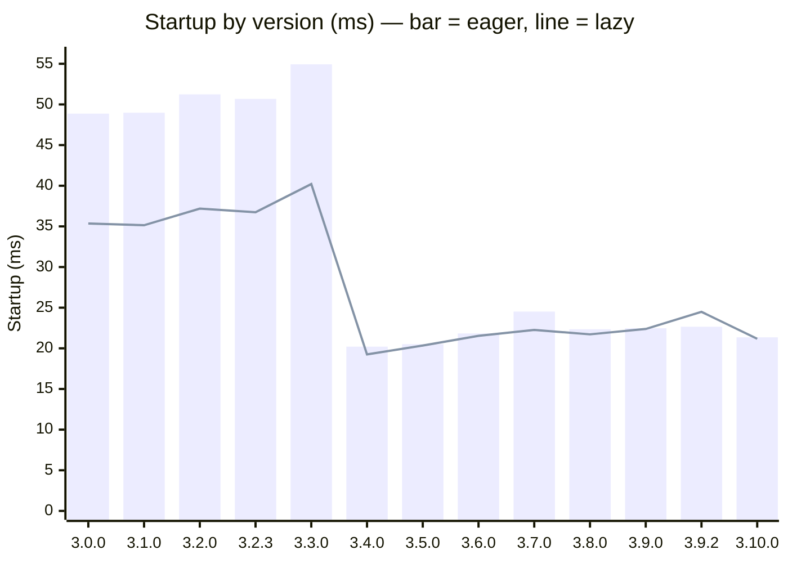

# Performance Benchmarks

This folder contains versioned performance benchmark results for Slothlet. Numbers are comparable **within** an era, not across it: v3.0.0–v3.3.0 were benchmarked on April-2026 hardware with the simpler `performance-benchmark.mjs`; v3.4.0+ were re-benchmarked on current hardware (June 2026, Node.js 24) with `performance-benchmark-aggregated.mjs`.

## Startup across all versions

Eager vs lazy startup (ms), each version plotted with its **own per-version doc numbers**. ⚠️ **Two benchmark eras — compare only within an era:** v3.0.0–v3.3.0 are April-2026 hardware (`performance-benchmark.mjs`); v3.4.0+ are June-2026 hardware (`performance-benchmark-aggregated.mjs`). The drop at v3.4.0 is that hardware/script change, **not a code speedup**. Within the current era, lazy ≈ eager because **lazy mode loads all root-level leaves at init** (only nested subtrees defer to the materializer), and `api_test` is mostly root-level leaves; the older runs measured lazy ~1.4x faster.



Full tables for both eras are in [cross-version-summary.md](./cross-version-summary.md).

## Benchmark Files

| File                                                   | Description                                                       |
| ------------------------------------------------------ | ----------------------------------------------------------------- |
| [v3.0.0.md](./v3.0.0.md)                               | Baseline — first stable v3 release                                |
| [v3.1.0.md](./v3.1.0.md)                               | Added `api.slothlet.env` snapshot                                 |
| [v3.2.0.md](./v3.2.0.md)                               | Added API Path Versioning (dispatcher proxy, version metadata)    |
| [v3.2.3.md](./v3.2.3.md)                               | Latest v3.2 patch (publish workflow fix)                          |
| [v3.3.0.md](./v3.3.0.md)                               | Added Permission System — includes with/without comparison        |
| [v3.4.0.md](./v3.4.0.md)                               | Context-conditional permission rules (uncached `condition` field) |
| [v3.5.0.md](./v3.5.0.md)                               | TypeScript runtime-import fixes + `slothlet typegen` CLI          |
| [v3.6.0.md](./v3.6.0.md)                               | Caller-identity controls for callbacks (`lockCaller` / `bind`)    |
| [v3.7.0.md](./v3.7.0.md)                               | Read-level permission gating (data reads checked, on by default)  |
| [v3.8.0.md](./v3.8.0.md)                               | Module discovery + mount pipeline (`api.slothlet.api.modules.*`)  |
| [v3.9.0.md](./v3.9.0.md)                               | Browser / worker mode (manifest-based, filesystem-free loading)   |
| [v3.9.2.md](./v3.9.2.md)                               | Critical async double-wrap fix (`2^N` → linear on fluent chains)  |
| [v3.10.0.md](./v3.10.0.md)                             | Synthetic / in-memory leaves + hook⇄permission integration        |
| [cross-version-summary.md](./cross-version-summary.md) | Side-by-side comparison table (both eras)                         |

## How Benchmarks Are Run

Each version is checked out at its tag and benchmarked against the same fixture directory (`api_tests/api_test`). v3.0.0–v3.3.0 used `performance-benchmark.mjs`; v3.4.0+ use the aggregated script:

```sh
node tests/performance/performance-benchmark-aggregated.mjs
```

**Test configuration:**

- 10 startup iterations (averaged)
- 100 function call iterations (averaged)
- 100 complex module iterations
- 50 per-module pattern iterations

**Test modules:**

- `math/math.mjs` — nested module (auto-flattened)
- `string/string.mjs` — nested module (auto-flattened)
- `funcmod/funcmod.mjs` — callable function module
- `nested/date/date.mjs` — deeply nested module

## Key Metrics

| Metric              | What It Measures                                           |
| ------------------- | ---------------------------------------------------------- |
| **Eager Startup**   | Time to initialize with all modules loaded upfront         |
| **Lazy Startup**    | Time to initialize with deferred module loading            |
| **Eager Calls**     | Average function call latency in eager mode                |
| **Lazy Calls**      | Average function call latency after lazy materialization   |
| **Materialization** | One-time cost to materialize a lazy module on first access |

## Interpreting Results

- **Startup times** include module discovery, file loading, proxy creation, and API tree construction.
- **Call times** are single-digit to low-double-digit microseconds — differences under ~5μs are measurement noise.
- **Materialization** is a one-time cost per module; subsequent calls are at full speed.
- Benchmarks run sequentially in a single Node.js process. GC pressure, V8 JIT warm-up, and system load introduce variance between runs.
